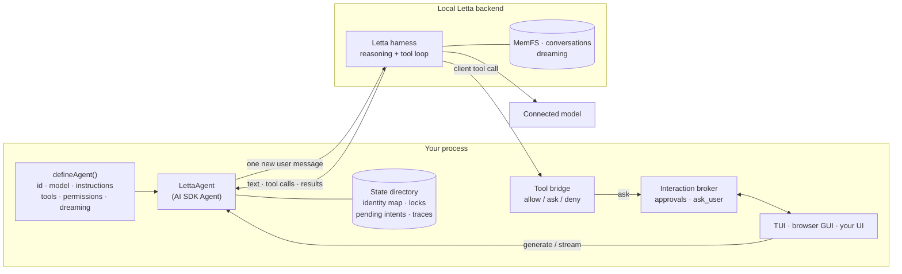

# ai-sdk-letta

A persistent, stateful [Letta](https://www.letta.com) agent, with memory and
dreaming, behind the [Vercel AI SDK](https://ai-sdk.dev) `Agent` interface.
Your application owns the tools and the human-in-the-loop.

> **Unofficial.** ai-sdk-letta is an independent project. It is not affiliated
> with, endorsed by, or sponsored by Letta or Vercel.

## What and why

The AI SDK gives you one interface for models, tools, streaming and UIs.
Letta gives you agents that *persist*: one identity with long-term memory
(MemFS, a git-versioned memory filesystem), many conversations, and
background "dreaming" that consolidates memory between turns. ai-sdk-letta
puts the two together:

- **`LettaAgent`** implements the AI SDK `Agent` interface (`generate`,
  `stream`). Letta runs the only reasoning and tool loop. Each call sends
  exactly one new user message; Letta keeps the transcript.
- **Tools are yours.** You define ordinary AI SDK `tool()`s. They run in *your*
  process when the agent calls them, through Letta's client-tool protocol,
  behind a fail-closed `allow` / `ask` / `deny` policy with schema validation,
  deadlines, cancellation and a metadata-only audit trail.
- **Human-in-the-loop is yours.** Per-call approvals and a built-in `ask_user`
  question tool go through an interaction broker that you connect to any UI.
  A terminal UI and a browser UI are included.
- **Defined in code, stable identity.** You give the agent a logical ID. The
  first run creates the Letta agent and records the generated ID; later runs
  reopen the same agent, memory and conversations, and never create a duplicate.

## Architecture



| Package | What it is | License | On npm |
| --- | --- | --- | --- |
| [`ai-sdk-letta`](packages/ai-sdk-letta) | The library: `LettaAgent`, definitions, identity, conversations and history, tool bridge, interaction broker, memory policy | Apache-2.0 | yes |
| [`@ai-sdk-letta/server`](packages/server) | Local HTTP runtime: durable threads and runs, NDJSON events, answers, cancellation; a token API and a loopback browser app | Apache-2.0 | yes |
| [`@ai-sdk-letta/provider`](packages/provider) | AI SDK `LanguageModel` for Letta agents; a port of Letta's provider | **MIT** (Letta) | yes |
| [`@ai-sdk-letta/tui`](apps/tui) | Terminal UI (patched `@ai-sdk/tui`) with `/resume`, `/search`, approvals and questions | Apache-2.0 | not yet ([why](#not-on-npm-yet)) |
| [`@ai-sdk-letta/web`](apps/web) | assistant-ui browser app served by the server package | Apache-2.0 | not yet ([why](#not-on-npm-yet)) |
| [`examples/basic`](examples/basic) | A minimal agent with one custom tool, in the terminal and the browser | Apache-2.0 | no |

### Provider or Agent?

- Use **`@ai-sdk-letta/provider`** for `generateText` / `streamText` against an
  existing Letta agent, where Letta runs its own tools. It is a plain AI SDK
  model provider.
- Use **`LettaAgent`** when your application defines the agent in code, owns
  the tools and needs approvals or questions from a human. It adds identity
  mapping, delivery safety, conversations, history restore and the policy
  layer. The two packages share no runtime code today: the provider speaks
  `LanguageModelV2` for broad AI SDK compatibility, while `LettaAgent`
  implements the `Agent` interface on `LanguageModelV4`, and the delivery and
  replay guarantees differ. Merging them would have changed tested behaviour
  in both.

## Prerequisites

- Node.js 22.19 or newer, and npm.
- The Letta CLI and a **local Letta backend** with a **connected model**. The
  library uses the Letta Agent SDK's `local` backend, which starts the Letta
  App Server itself; you do not run a server process. From the
  [Letta self-hosting guide](https://docs.letta.com/self-hosting/index.md):

  ```sh
  npm install -g @letta-ai/letta-code
  letta --backend local connect ollama        # or: anthropic, openai, lmstudio, ...
  ```

  For example, to use a ChatGPT Plus/Pro subscription, connect the `chatgpt`
  provider (`letta --backend local connect chatgpt`), or run `/connect` inside
  `letta`. See [Models](https://docs.letta.com/configuration/models/index.md)
  for every provider.
- A model **handle** for your definition. List what your backend offers with:

  ```sh
  letta --backend local model list
  ```

  The example defaults to `openai-codex/gpt-5.5`; set `LETTA_MODEL` to use
  another handle.

No Letta account or model is needed to install, typecheck, test or build this
repository.

## Install

```sh
npm install ai-sdk-letta ai                 # the LettaAgent library (ai is a peer dependency)
npm install @ai-sdk-letta/server            # optional: the local HTTP runtime
npm install @ai-sdk-letta/provider ai zod   # or: the plain AI SDK provider
```

The packages are ESM, typed, and need Node.js 22.19 or newer. `ai-sdk-letta`
and `@ai-sdk-letta/server` always share a version; `@ai-sdk-letta/provider`
is versioned on its own. Releases and changelogs:
[GitHub releases](https://github.com/leonardschneider/ai-sdk-letta/releases).

### Not on npm yet

- **`@ai-sdk-letta/tui`** needs a patched `@ai-sdk/tui`. The patch is applied
  by this repository's `postinstall`, which does not run for packages
  installed from npm, so the TUI is used from a checkout of this repository
  for now (`npm run tui`). Whether it will depend on a published fork of
  `@ai-sdk/tui` or wait for the changes upstream is still open.
- **`@ai-sdk-letta/web`**, the browser app, is built in this repository and
  passed to `startGuiServer` as an assets directory (`npm run gui`). How it
  will be packaged for npm is a follow-up.

## Quickstart (from source)

```sh
git clone https://github.com/leonardschneider/ai-sdk-letta.git
cd ai-sdk-letta
npm ci
npm run build             # builds every package and the web app

npm run tui               # terminal UI for the example agent
npm run gui               # browser UI on http://127.0.0.1:4400
```

Both run [`examples/basic`](examples/basic). The first run creates a Letta
agent named "Example Assistant"; later runs reopen it. Useful variables:
`LETTA_MODEL` (model handle), `AGENT_ID` (logical ID, for a throwaway agent),
`AI_SDK_LETTA_STATE_DIR` (state directory), `TEXT_STATS_PERMISSION=ask` (try
approvals). Pass options after `--`, for example `npm run gui -- --port 4500`
or `npm run tui -- --new "Planning"`.

## Defining an agent and tools

```ts
import { tool, jsonSchema } from 'ai';
import { askUserTool, createLettaAgent, defineAgent } from 'ai-sdk-letta';

const agent = defineAgent({
  id: 'support-assistant',                 // stable logical ID, never reused for another agent
  name: 'Support Assistant',
  model: 'anthropic/claude-sonnet-4-5',    // any handle from `letta --backend local model list`
  instructions: 'You help customers. Look up orders with lookup_order.',
  tools: {
    lookup_order: tool({
      description: 'Look up an order by ID.',
      inputSchema: jsonSchema<{ id: string }>({
        type: 'object', properties: { id: { type: 'string' } }, required: ['id'], additionalProperties: false,
      }),
      execute: async ({ id }) => ({ id, status: 'shipped' }),
    }),
    ask_user: askUserTool,                 // optional: structured questions to the human
  },
  // Fail-closed: every tool needs an entry. 'ask' prompts for approval per call.
  permissions: { lookup_order: 'ask', ask_user: 'allow' },
  dreaming: { trigger: 'step-count', stepCount: 25 },
});

const { agent: support, close } = await createLettaAgent(agent);
support.interactions.connect(async request =>
  request.kind === 'approval'
    ? { id: request.id, approved: true }               // render a real prompt here
    : { id: request.id, text: 'Please use express shipping' });
try {
  const result = await support.generate({ prompt: 'Where is order 42?' });
  console.log(result.text, result.toolResults);
} finally {
  await close();
}
```

`LettaAgent` is a regular AI SDK `Agent`, so `stream()` returns a
`StreamTextResult` (`toUIMessageStream()`, `fullStream`, ...). Tool calls
arrive as `providerExecuted` parts: the AI SDK displays them but never runs
them itself.

### Images

A user turn can carry images as AI SDK `image` or `file` parts (base64,
bytes or `data:` URLs; `convertToModelMessages` output works as is). They
are sent to Letta as `ImageContent`, together with the text, as one new user
message:

```ts
import { readFileSync } from 'node:fs';
await support.generate({ messages: [...support.transcript, { role: 'user', content: [
  { type: 'text', text: 'What is in this screenshot?' },
  { type: 'image', image: readFileSync('screenshot.png') },
] }] });
```

- **Types and limits:** PNG, JPEG, GIF and WebP, checked by content (not by
  name or declared type); up to 5 MB per image, 4 images and 10 MB in total
  per message (`IMAGE_LIMITS`). Anything else fails before delivery with an
  `ImageInputError` whose `code` is one of `image_unsupported_type`,
  `image_invalid`, `image_remote_url`, `image_too_large`, `images_too_many`,
  `images_too_large`. Image URLs are never fetched.
- **No replay:** history must still extend exactly what was sent. Images in
  history are compared by a SHA-256 of their bytes, and the agent keeps only
  that hash (`agent.transcript`), never a second copy of the image.
- **The model must accept images.** The Letta harness passes them to the
  connected model; verified with `openai-codex/gpt-5.5`.
- **Images are stored in Letta history,** and so in the local backend's agent
  state (`LETTA_LOCAL_BACKEND_DIR`) like any message. Restored conversations
  show them again: the browser app displays the newest 48 MB of images per
  conversation and `[Image]` for older or undisplayable ones; the terminal
  shows `[Image]`. The HTTP runtime's own state files record only each
  image's type, size and hash.

What a definition controls, and when:

| Field | Applied |
| --- | --- |
| `id`, `name` | Every start: the mapping and the Letta agent name must match, or startup fails. |
| `model`, `instructions` | At creation only. To change them, create a new logical ID (or change the agent in Letta). |
| `tools`, `permissions`, `toolTimeoutMs` | Every start. |
| `dreaming` | Every start, scoped to this project (see below), then verified. |

## TUI

```sh
npm run tui                        # startup picker: resume, pick, or create a conversation
npm run tui -- --resume            # reopen the last conversation
npm run tui -- --new "Planning"    # new conversation
npm run tui -- --conversation ID   # a specific conversation
npm run tui -- --list              # list conversations and exit (no TTY needed)
```

Inside: `/resume [title or ID]`, `/search [text]` (this agent's
conversations only), `/help`; PgUp/PgDn scroll restored history; Esc exits.
Approvals and questions appear as prompts during the turn that needs them.

**Images.** Press **Ctrl+V** to attach an image from the clipboard, or drag
an image file into the terminal (or paste its path; shell-escaped, quoted
and `file://` paths all work). Each attachment shows as `[Image 1]`,
`[Image 2]`, ... in the prompt; Backspace right after a marker removes it.
Sent and restored messages show `[Image]`. Clipboard access uses `osascript`
on macOS (screenshots, copied images, or image files copied in Finder) and
`wl-paste` or `xclip` on Linux when installed; without them, Ctrl+V shows a
short notice and dropping a file still works. The terminal does not resize
images: files over 5 MB are refused with a notice (the browser app
downscales automatically).

Use it from code with `runTerminal(definition, process.argv.slice(2))` from
`@ai-sdk-letta/tui`.

**The `@ai-sdk/tui` patch.** The TUI depends on `@ai-sdk/tui` pinned at
1.0.119 plus [a patch](apps/tui/patches) applied by `patch-package` on
install. It adds display-only restored history, local slash commands, and an
interaction renderer for approvals and questions. These changes are being
upstreamed through a fork of `vercel/ai`; until then, keep the pinned version.
Because the patch only applies inside this repository, `@ai-sdk-letta/tui` is
not published to npm yet.

## GUI

```sh
npm run gui                        # http://127.0.0.1:4400
npm run gui -- --port 4500 --state-dir /path/to/state
```

A browser app built with [assistant-ui](https://www.assistant-ui.com):
threads with rename and archive, streaming replies, tool activity lines with
collapsed technical details, docked approval and question cards, and safe
Markdown.

**Images.** Paste an image (⌘V / Ctrl+V), drop image files on the composer,
or use the paperclip. Thumbnails can be removed before sending; images
larger than 2048 px are downscaled in the browser (and re-encoded if still
over 5 MB). Sent images appear in your message, also after a reload, and
open larger on click. Pasting text still pastes text, including rich text
copied with a snapshot image (as Office apps do). Unsupported, oversized or
too many images show a notice and are not attached. Use it from code with `startGuiServer(definition, assetsDir, options)`
from `@ai-sdk-letta/server`. The same package offers `startApiServer` for a
token-authenticated server-to-server API with the same routes.

## Security model

- **Tools fail closed.** A tool without a permission entry, or with `deny`, is
  never exposed. Arguments are validated against the tool's JSON Schema before
  any prompt or execution. Each call ID runs at most once. Approval is bound to
  a snapshot of the exact arguments. Handlers get a deadline and an abort
  signal; outputs are size-bounded and errors are reduced to fixed codes.
- **Human answers are exactly-once.** Each prompt has a unique ID; answers are
  validated against it and accepted once. Stale, duplicate or malformed
  answers are rejected. Without a connected renderer, prompts fail closed.
- **No replay.** `LettaAgent` sends only the newest user message, and rejects
  history that does not extend exactly what it already sent. After a failure
  or cancellation it refuses further turns.
- **Uncertain delivery blocks.** A durable intent is written before each turn
  and removed only after a confirmed finish. If the process dies in between,
  that conversation stays blocked until you inspect it; nothing is resent.
  Agent and conversation creation use the same pattern, so a crash cannot
  create duplicates.
- **Memory is confined.** The harness gets only `Read`, `Write` and `Edit` on
  Markdown files inside the agent's own MemFS directory (no dot-files,
  traversal, symlinks or hard links) and one exact `git commit` command.
- **The GUI is loopback-only.** It binds to 127.0.0.1 and checks the Host
  header, the Origin, and fetch metadata. A random HttpOnly, SameSite=Strict
  cookie authenticates the browser, and every mutation also needs an
  in-memory CSRF token. No bearer token reaches the browser. A strict CSP
  applies (images: same origin, `data:` and `blob:` only, never remote),
  Markdown skips raw HTML and never loads remote images, and technical
  details stay collapsed by default. Only `POST /v1/runs` accepts a larger
  body (about 13.4 MB, for images); every other route keeps a 24 KB limit.
  Images are validated again on the server (type by content, size, count).
- **The token API** needs a 256-bit bearer token (stored 0600) plus an owner
  header, and rejects browser origins.
- **Audit.** Tool activity is logged as metadata only (tool, status, duration,
  hashed call ID) in private files under the state directory.

## State and identity

State lives in one directory, resolved in this order:

1. the `stateDirectory` option (`--state-dir` in the example CLIs);
2. the `AI_SDK_LETTA_STATE_DIR` environment variable;
3. `$XDG_STATE_HOME/ai-sdk-letta`, else `~/.local/state/ai-sdk-letta`
   (Linux and macOS), or `%LOCALAPPDATA%\ai-sdk-letta\state` (Windows).

```
<state>/
  agents/                  identity mappings, locks, pending intents; the Letta session cwd
    <id>.json              logical ID -> Letta agent ID, backend, last conversation
    <id>.lock              held while a process has the agent open
    <id>.pending.json      an agent creation whose outcome is unknown
    <id>.<conv>.turn.pending.json   a turn whose delivery is unconfirmed
  tool-traces/             metadata-only tool audit (NDJSON, per day)
  server/<id>/gui|api/     thread and run records for the HTTP runtime
```

**Keeping an existing agent.** The mapping is what ties a logical ID to a
Letta agent. To reuse an agent you already created with an earlier tool or
version, point `AI_SDK_LETTA_STATE_DIR` (or `stateDirectory`) at a directory
whose `agents/<id>.json` holds that mapping, and use the same `id` and
`name`. Nothing is migrated or modified automatically; if the mapping names a
different backend or agent name, startup fails rather than creating a new
agent.

The mapping is also keyed to the Letta local backend directory
(`LETTA_LOCAL_BACKEND_DIR`, default `~/.letta/lc-local-backend`).

**Recovering after a crash.** Errors name the exact file. A `.lock` whose PID
is no longer running can be removed. A `pending` intent means an outcome is
unknown: inspect the backend (for example with the Letta CLI) and reconcile
by hand before removing it.

**Dreaming is project-scoped.** The Letta Agent SDK's `dreaming` option also
writes the user's global Letta settings. ai-sdk-letta does not use it.
Instead it sends the App Server's `set_reflection_settings` command with scope
`local_project`, whose project is the private `agents/` directory, and
verifies the effective settings on every start.

**Foreground tools.** By default the Letta harness moves a client tool to the
background after about 10 seconds, which would detach approvals and
questions. `openLettaAgent` sets `auto_background: false` with a five-minute
timeout for this agent's runtime (`foregroundExternalTools`, on by default).

## Limitations

- **Local backend only.** `openLettaAgent` uses the Agent SDK `local` backend.
  Letta Cloud and remote App Servers are not supported by `LettaAgent` yet
  (the provider package does support them).
- **One process per agent.** The identity lock allows one open runtime per
  logical ID. The HTTP runtime runs one turn at a time.
- **Text and images only.** Up to 8,000 characters and 4 images (PNG, JPEG,
  GIF, WebP; 5 MB each, 10 MB total) per turn; no other file types. No
  history edits, regeneration or retries by design.
- **Images in restored history** are shown when Letta returns them: the
  browser displays the newest 48 MB per conversation and `[Image]` for the
  rest; the terminal always shows `[Image]`. A reply that is still running
  after a browser refresh shows `[Image]` until it completes.
- **Model and instructions are fixed at creation.**
- **Human waits are bounded** by the harness's five-minute external-tool
  limit; the HTTP runtime closes prompts earlier (four minutes by default).
- **Pinned versions.** `@letta-ai/letta-agent-sdk` is pinned at 0.8.22 and
  `@ai-sdk/tui` at 1.0.119 (patched); `ai` is a peer dependency (`^7.0.118`;
  this repository tests 7.0.118). Some workarounds depend on SDK behaviour at
  these versions (for example, history for the default conversation is read
  through a protocol command).
- **The TUI and the browser app are not on npm yet.** Run them from a
  checkout (see [Install](#install)).
- **Live tests are opt-in** (`AI_SDK_LETTA_LIVE=1 npm run test:live`) and
  consume model usage.

## Development

```sh
npm ci
npm run typecheck
npm test                 # offline; PTY tests need python3 and skip without it
npm run build
AI_SDK_LETTA_LIVE=1 AI_SDK_LETTA_LIVE_STATE_DIR=/tmp/ai-sdk-letta-live npm run test:live
```

See [CONTRIBUTING.md](CONTRIBUTING.md). Releases use Changesets and npm
trusted publishing; see [RELEASING.md](RELEASING.md).

## AI assistance

This project was developed with AI assistance, directed and reviewed by the
author.

## License

[Apache-2.0](LICENSE), except [`packages/provider`](packages/provider), which
is MIT-licensed work by Letta ([its LICENSE](packages/provider/LICENSE)). See
[NOTICE](NOTICE). "Letta" and "Vercel" are trademarks of their respective
owners.
