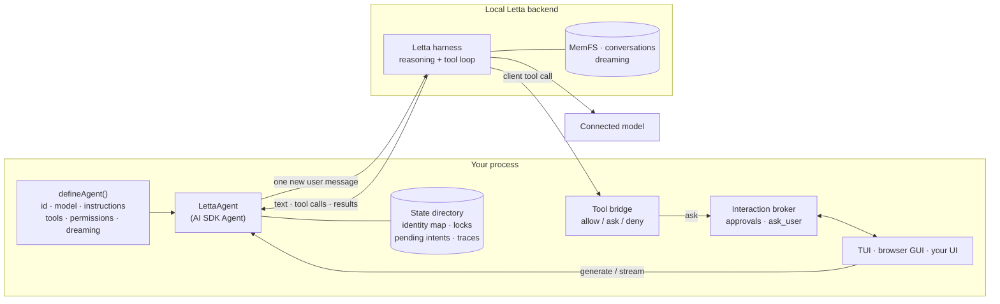

# ai-sdk-letta

A persistent, stateful [Letta](https://www.letta.com) agent, with memory and
dreaming, behind the [Vercel AI SDK](https://ai-sdk.dev) `Agent` interface.
Your application owns the tools and the human-in-the-loop.

> **Unofficial.** ai-sdk-letta is an independent project. It is not affiliated
> with, endorsed by, or sponsored by Letta or Vercel.

## What and why

The AI SDK gives you one interface for models, tools, streaming and UIs.
Letta gives you agents that *persist*: one identity with long-term memory
(MemFS, a git-versioned memory filesystem), many conversations, and
background "dreaming" that consolidates memory between turns. ai-sdk-letta
puts the two together:

- **`LettaAgent`** implements the AI SDK `Agent` interface (`generate`,
  `stream`). Letta runs the only reasoning and tool loop. Each call sends
  exactly one new user message; Letta keeps the transcript.
- **Tools are yours.** You define ordinary AI SDK `tool()`s. They run in *your*
  process when the agent calls them, through Letta's client-tool protocol,
  behind a fail-closed `allow` / `ask` / `deny` policy with schema validation,
  deadlines, cancellation and a metadata-only audit trail.
- **Human-in-the-loop is yours.** Per-call approvals and a built-in `ask_user`
  question tool go through an interaction broker that you connect to any UI.
  A terminal UI and a browser UI are included. For choices that can wait,
  the agent asks for a [decision](#decisions): it pauses the work, everyone
  in the agent is notified in the app, and the work resumes (or stops) when
  someone decides.
- **Defined in code, stable identity.** You give the agent a logical ID. The
  first run creates the Letta agent and records the generated ID; later runs
  reopen the same agent, memory and conversations, and never create a duplicate.

## Architecture



| Package | What it is | License | On npm |
| --- | --- | --- | --- |
| [`ai-sdk-letta`](packages/ai-sdk-letta) | The library: `LettaAgent`, definitions, identity, conversations and history, tool bridge, interaction broker, memory policy | Apache-2.0 | yes |
| [`@ai-sdk-letta/server`](packages/server) | Local HTTP runtime: durable threads and runs, NDJSON events, answers, cancellation; a token API and a loopback browser app | Apache-2.0 | yes |
| [`@ai-sdk-letta/provider`](packages/provider) | AI SDK `LanguageModel` for Letta agents; a port of Letta's provider | **MIT** (Letta) | yes |
| [`@ai-sdk-letta/tui`](apps/tui) | Terminal UI (patched `@ai-sdk/tui`) with `/resume`, `/search`, approvals and questions | Apache-2.0 | not yet ([why](#not-on-npm-yet)) |
| [`@ai-sdk-letta/web`](apps/web) | assistant-ui browser app served by the server package | Apache-2.0 | not yet ([why](#not-on-npm-yet)) |
| [`n8n-nodes-ai-sdk-letta`](packages/n8n-nodes-ai-sdk-letta) | n8n community node: run a turn, wait for the reply (and through decisions), branch on `approval_required` | **MIT** (n8n's rule for community nodes) | not yet |
| [`examples/basic`](examples/basic) | A minimal agent with one custom tool, in the terminal and the browser | Apache-2.0 | no |
| [`examples/orchestration`](examples/orchestration) | Conductor OSS workflow definitions, a Conductor worker, schedules | Apache-2.0 | no |

### Provider or Agent?

- Use **`@ai-sdk-letta/provider`** for `generateText` / `streamText` against an
  existing Letta agent, where Letta runs its own tools. It is a plain AI SDK
  model provider.
- Use **`LettaAgent`** when your application defines the agent in code, owns
  the tools and needs approvals or questions from a human. It adds identity
  mapping, delivery safety, conversations, history restore and the policy
  layer. The two packages share no runtime code today: the provider speaks
  `LanguageModelV2` for broad AI SDK compatibility, while `LettaAgent`
  implements the `Agent` interface on `LanguageModelV4`, and the delivery and
  replay guarantees differ. Merging them would have changed tested behaviour
  in both.

## Prerequisites

- Node.js 22.19 or newer, and npm.
- The Letta CLI and a **local Letta backend** with a **connected model**. The
  library uses the Letta Agent SDK's `local` backend, which starts the Letta
  App Server itself; you do not run a server process. From the
  [Letta self-hosting guide](https://docs.letta.com/self-hosting/index.md):

  ```sh
  npm install -g @letta-ai/letta-code
  letta --backend local connect ollama        # or: anthropic, openai, lmstudio, ...
  ```

  For example, to use a ChatGPT Plus/Pro subscription, connect the `chatgpt`
  provider (`letta --backend local connect chatgpt`), or run `/connect` inside
  `letta`. See [Models](https://docs.letta.com/configuration/models/index.md)
  for every provider.
- A model **handle** for your definition. List what your backend offers with:

  ```sh
  letta --backend local model list
  ```

  The example defaults to `openai-codex/gpt-5.5`; set `LETTA_MODEL` to use
  another handle.

No Letta account or model is needed to install, typecheck, test or build this
repository.

## Install

```sh
npm install ai-sdk-letta ai                 # the LettaAgent library (ai is a peer dependency)
npm install @ai-sdk-letta/server            # optional: the local HTTP runtime
npm install @ai-sdk-letta/provider ai zod   # or: the plain AI SDK provider
```

The packages are ESM, typed, and need Node.js 22.19 or newer. `ai-sdk-letta`
and `@ai-sdk-letta/server` always share a version; `@ai-sdk-letta/provider`
is versioned on its own. Releases and changelogs:
[GitHub releases](https://github.com/leonardschneider/ai-sdk-letta/releases).

### Not on npm yet

- **`@ai-sdk-letta/tui`** needs a patched `@ai-sdk/tui`. The patch is applied
  by this repository's `postinstall`, which does not run for packages
  installed from npm, so the TUI is used from a checkout of this repository
  for now (`npm run tui`). Whether it will depend on a published fork of
  `@ai-sdk/tui` or wait for the changes upstream is still open.
- **`@ai-sdk-letta/web`**, the browser app, is built in this repository and
  passed to `startGuiServer` as an assets directory (`npm run gui`). How it
  will be packaged for npm is a follow-up.

## Quickstart (from source)

```sh
git clone https://github.com/leonardschneider/ai-sdk-letta.git
cd ai-sdk-letta
npm ci
npm run build             # builds every package and the web app

npm run tui               # terminal UI for the example agent
npm run gui               # browser UI on http://127.0.0.1:4400
```

Both run [`examples/basic`](examples/basic). The first run creates a Letta
agent named "Example Assistant"; later runs reopen it. Useful variables:
`LETTA_MODEL` (model handle), `AGENT_ID` (logical ID, for a throwaway agent),
`AI_SDK_LETTA_STATE_DIR` (state directory), `TEXT_STATS_PERMISSION=ask` (try
approvals), `DECISIONS=1` (try [decisions](#decisions)), `WEB_SEARCH=1` with `SEARXNG_URL` (try [web search](#web-search); `WEB_SEARCH_REVIEW_MS` and `WEB_SEARCH_STALE_MS` set the review time and when "Search again" is offered). Pass options after `--`, for example `npm run gui -- --port 4500`
or `npm run tui -- --new "Planning"`.

To build your own agent, follow [Building your own agent](docs/building-your-own-agent.md),
starting from [`examples/starter`](examples/starter).

## Defining an agent and tools

Step by step, with testing and troubleshooting: [Building your own agent](docs/building-your-own-agent.md).

```ts
import { tool, jsonSchema } from 'ai';
import { askUserTool, createLettaAgent, defineAgent } from 'ai-sdk-letta';

const agent = defineAgent({
  id: 'support-assistant',                 // stable logical ID, never reused for another agent
  name: 'Support Assistant',
  model: 'anthropic/claude-sonnet-4-5',    // any handle from `letta --backend local model list`
  instructions: 'You help customers. Look up orders with lookup_order.',
  tools: {
    lookup_order: tool({
      description: 'Look up an order by ID.',
      inputSchema: jsonSchema<{ id: string }>({
        type: 'object', properties: { id: { type: 'string' } }, required: ['id'], additionalProperties: false,
      }),
      execute: async ({ id }) => ({ id, status: 'shipped' }),
    }),
    ask_user: askUserTool,                 // optional: structured questions to the human
  },
  // Fail-closed: every tool needs an entry. 'ask' prompts for approval per call.
  permissions: { lookup_order: 'ask', ask_user: 'allow' },
  dreaming: { trigger: 'step-count', stepCount: 25 },
});

const { agent: support, close } = await createLettaAgent(agent);
support.interactions.connect(async request =>
  request.kind === 'approval'
    ? { id: request.id, approved: true }               // render a real prompt here
    : { id: request.id, text: 'Please use express shipping' });
try {
  const result = await support.generate({ prompt: 'Where is order 42?' });
  console.log(result.text, result.toolResults);
} finally {
  await close();
}
```

`LettaAgent` is a regular AI SDK `Agent`, so `stream()` returns a
`StreamTextResult` (`toUIMessageStream()`, `fullStream`, ...). Tool calls
arrive as `providerExecuted` parts: the AI SDK displays them but never runs
them itself.

### Images

A user turn can carry images as AI SDK `image` or `file` parts (base64,
bytes or `data:` URLs; `convertToModelMessages` output works as is). They
are sent to Letta as `ImageContent`, together with the text, as one new user
message:

```ts
import { readFileSync } from 'node:fs';
await support.generate({ messages: [...support.transcript, { role: 'user', content: [
  { type: 'text', text: 'What is in this screenshot?' },
  { type: 'image', image: readFileSync('screenshot.png') },
] }] });
```

- **Types and limits:** PNG, JPEG, GIF and WebP, checked by content (not by
  name or declared type); up to 5 MB per image, 4 images and 10 MB in total
  per message (`IMAGE_LIMITS`). Anything else fails before delivery with an
  `ImageInputError` whose `code` is one of `image_unsupported_type`,
  `image_invalid`, `image_remote_url`, `image_too_large`, `images_too_many`,
  `images_too_large`. Image URLs are never fetched.
- **No replay:** history must still extend exactly what was sent. Images in
  history are compared by a SHA-256 of their bytes, and the agent keeps only
  that hash (`agent.transcript`), never a second copy of the image.
- **The model must accept images.** The Letta harness passes them to the
  connected model; verified with `openai-codex/gpt-5.5`.
- **Images are stored in Letta history,** and so in the local backend's agent
  state (`LETTA_LOCAL_BACKEND_DIR`) like any message. Restored conversations
  show them again: the browser app displays the newest 48 MB of images per
  conversation and `[Image]` for older or undisplayable ones; the terminal
  shows `[Image]`. The HTTP runtime's own state files record only each
  image's type, size and hash.

### Files

Add the built-in file tools to a definition to let users attach files:

```ts
import { defineAgent, fileTools, FILE_TOOL_PERMISSIONS } from 'ai-sdk-letta';

defineAgent({ ...,
  tools: { ...fileTools, lookup_order },                         // list_files, read_file, search_files
  permissions: { ...FILE_TOOL_PERMISSIONS, lookup_order: 'ask' }, // 'allow' by default; 'ask' or 'deny' work too
});
```

They are opt-in, like every tool: a definition without them (or with
`read_file: 'deny'`) accepts images only, exactly as before. The example
agent includes them.

- **How it works.** Attached files are stored in the conversation's folder
  of the agent's [resources](#resources). The user's message carries only a short note per file,
  such as `Attached: report.pdf (PDF, 12 pages, 2.1 MB)`, never the content.
  The agent then reads what it needs: `list_files(folder?)` (name, type, size, page
  or line count), `read_file(name, range)` (PDF pages such as `"3"` or
  `"2-4"`, or text lines; about 12,000 characters per call, and the result
  says when it is truncated and which range to read next) and
  `search_files(query, name?, folder?)` (passages with file name and page or line).
- **The current conversation first, every conversation reachable.** The
  runtime binds the tools to the conversation it opened: a plain name such as
  `report.pdf` or `data/raw.csv` resolves in that conversation's folder, and a
  name starting with `/` (`/Trip planning/itinerary.md`; `/workspace/...`
  works too) resolves from the resources root, so the agent can use files
  from any of its conversations. `list_files` with folder `"/"` lists them
  all. Names never leave the root: `..`, hidden names and symlinks are
  refused, and hard-linked files are not read. Files the agent creates with
  shell commands are readable too, described by content.
- **Types, detected by content:** plain text, Markdown, CSV, JSON, code and
  other UTF-8 text (binary content is refused whatever its name), PDF, and
  the image types above. Office documents are refused with a hint to export
  a PDF. Errors are `FileInputError`s with a fixed `code`:
  `file_unsupported_type`, `file_invalid`, `file_too_large`,
  `files_too_many`, `conversation_files_full`, `file_not_found`,
  `file_name_invalid`, `file_range_invalid`, `file_exists`, `resources_busy`,
  `resources_full`.
- **PDFs** are read with [unpdf](https://github.com/unjs/unpdf) (Mozilla's
  PDF.js, pure JavaScript, no native modules) in a worker thread with a
  memory cap and a deadline. Scripts in PDFs are never run. Text is
  extracted once, when the file is attached. **Scanned pages** (no text
  layer): `read_file` returns the page's own image to the model (decoded by
  PDF.js and encoded as PNG, up to 1600 px), so the model can read it. A
  page without text or a large image (a vector drawing) is reported as
  having no extractable text. Password-protected PDFs are refused.
- **Images** are still sent inline, as before, and are also saved to the
  folder, so `list_files` shows them and `read_file` can show one again.
- **Limits** (`FILE_LIMITS`): 25 MB per file, 8 files per message (images
  keep their own limits), 100 attached files and 250 MB per conversation
  folder, the first 2,000 pages of a PDF.
- **No replay.** The note is ordinary text in Letta history. In the
  transcript, files are kept as SHA-256 references, like images; history
  that changes a file is refused as an edit.
- **From code**, pass AI SDK `file` parts in the new user turn
  (`{ type: 'file', mediaType, filename, data }`, with bytes, base64 or a
  `data:` URL; remote URLs are never fetched).

### Resources

All of an agent's files live in one folder, its **resources**, versioned
with git: one folder per conversation, plus any folders the user makes.
The GUI shows them in a panel where the user can preview, upload, move,
rename and delete them (see [GUI](#gui)); the TUI lists them with `/resources`.
They are enabled by the file tools or the sandbox.

```
<state>/resources/<letta agent ID>/
  files/            the work tree: one folder per conversation (named after its title) and user folders
  git/              the git repository (separate from the work tree; no remote)
  cache/            text extracted from PDFs, by content hash
  state.json        which folder belongs to which conversation; where each attached file is now
  resources.lock    held during a git operation
```

- **Folders are named after the conversation's title** (the text it shows,
  never its Markdown: `[Spec](https://…) **v2**` gives "Spec v2"; made a valid,
  unique name; "Trip planning", "Trip planning (2)") and **follow it**: when
  the conversation is renamed, its folder is renamed too, as one commit
  (`Rename folder Trip planning → Lisbon`), wherever the folder is now, also
  if you renamed or moved it in the panel. While a turn of that conversation
  runs, the rename waits until the turn ends (after its end-of-turn commit),
  so commands that are running keep their working directory. A folder you
  deleted is not recreated by a rename. The mapping from conversation to
  folder is stored by ID, so it survives renames and moves of the folder
  (also `mv` in the sandbox, followed by inode).
- **The other way round, too:** renaming a conversation's own folder in the
  panel renames the conversation to the name as you typed it (folder names
  are plain text; "Porto: day trips" stays so in the title even though the
  folder is "Porto_ day trips"). A title that already shows that text keeps its
  Markdown (`[Spec](https://…) **v2**` stays for "Spec v2"). Moving the
  folder elsewhere under the same name, renaming a folder around it, or the
  agent renaming it in the sandbox leaves the title as it is. The title
  change is metadata, not a commit, and never renames the folder again; a
  suffix added to keep a folder name unique ("Trip (2)") stays out of the
  title.
- **One commit per change.** Every user operation (upload, new folder, move,
  rename, delete, restore) is one commit with a clear message, such as
  `Rename Trip planning/notes.txt to itinerary.md`. Attachments are committed
  as `Attach report.pdf in Trip planning`. Whatever the agent changed during
  a turn, finished or not, is committed at the end of the turn as
  `Agent changes in <folder>`. A user operation commits only its own paths,
  so a user action during a turn never sweeps up the agent's half-done work.
  Changes made while the app was closed are committed on the next start.
- **Git runs isolated and serialized.** A fixed identity
  (`ai-sdk-letta <resources@ai-sdk-letta.invalid>`), `GIT_CONFIG_GLOBAL=/dev/null`,
  `GIT_CONFIG_NOSYSTEM=1`, literal pathspecs, no hooks, no remote. A lock
  (a queue in the process plus a lock file across processes; a lock left
  by a process that died is taken over) keeps user actions, the agent's
  commit and other processes from racing.
- **The agent cannot rewrite the history.** The repository lives in `git/`,
  next to the work tree, and only `files/` is mounted in the sandbox. From
  `/workspace`, `git` finds no repository, so the agent's own `git` commands
  never touch the resources history. Repositories the agent creates in a
  folder (`git init` in `/workspace/<folder>/project`) work as before; their
  files are versioned by the resources too (their `.git` is not), and their
  settings are reduced to plain ones and active hooks removed, because git
  on your computer would obey them.
- **Not versioned:** `.venv/`, `.home/`, `__pycache__/`, `node_modules/` and
  other caches (the list, `RESOURCES_GITIGNORE`, is kept in the repository's
  `info/exclude`, which commands cannot change; `.gitignore` files in
  folders apply too), symlinks, and files over 100 MB. Hidden entries (names
  starting with a dot), `__pycache__` and `node_modules` are not shown.
- **Deleting keeps history.** The panel's Undo restores a deleted file or
  folder from the commit before the delete. To recover anything later, use
  git directly:

  ```sh
  cd <state>/resources/<letta agent ID>
  git --git-dir=git --work-tree=files log --stat               # what changed, when
  git --git-dir=git --work-tree=files restore --source=<commit>^ -- "Trip planning/notes.txt"
  ```

- **Upgrading from 0.3.** Files attached with 0.3 (in
  `<state>/attachments/<agent ID>/<conversation ID>/`) are moved into the
  resources automatically the first time the agent opens: each conversation
  gets a folder named after its title, the files keep their names, the move
  is one commit (`Import attachments from earlier versions`), and the old
  folders are kept aside in `<state>/attachments/<agent ID>/.migrated/`. It
  is idempotent and resumable. Links to files in older messages keep working,
  also after you move or rename the files: they resolve through the record
  of where each attached file is now (`state.json`), then the conversation's
  folder, then the same content anywhere in the resources.
- **From code:** `ResourceStore.open(statePaths(dir).resources, agentId)`
  gives `tree()`, `upload()`, `createFolder()`, `move()`, `delete()`,
  `restore()`, `log()` and `commitAll()`; `LettaRuntime.resources` is the
  open agent's store.

### Atlassian (Jira and Confluence)

Add the Atlassian tools to let the agent read and edit Jira issues and
Confluence pages (Atlassian Cloud) **as each user**, with their own API token:

```ts
import { atlassianTools, ATLASSIAN_TOOL_PERMISSIONS, defineAgent, fileTools, FILE_TOOL_PERMISSIONS } from 'ai-sdk-letta';

defineAgent({ ...,
  tools: { ...atlassianTools, ...fileTools },                              // atlassian_request, atlassian_fetch, atlassian_update
  permissions: { ...ATLASSIAN_TOOL_PERMISSIONS, ...FILE_TOOL_PERMISSIONS }, // reads 'allow'; atlassian_update 'ask'
});
```

The example agent includes them with `ATLASSIAN=1` (`ATLASSIAN=1 npm run gui`).

- **Each person connects their own account.** In the browser app, the
  sidebar shows **Connect Atlassian**: site (`https://<name>.atlassian.net`),
  email and an [API token](https://id.atlassian.com/manage-profile/security/api-tokens).
  The server checks them (`GET /rest/api/3/myself`) and stores them for that
  person only: `<state>/credentials/atlassian/<hash of the user ID>.json`,
  0600 in a 0700 folder, written atomically. The token is never sent back to
  the browser (the dialog shows site, email, account and the last check),
  never given to the agent, its tools' results, the sandbox, logs or other
  people. **Test connection**, **Replace token** and **Disconnect** are in
  the same dialog. When Atlassian answers 401 (the token expired or was
  revoked), the connection is marked, the sidebar says *Replace token*, and
  the tools tell the agent to ask the user to replace it.
- **The tools act as the person whose message started the turn**: the local
  user in the single-user GUI and the TUI, each message's author on a team
  server. A person who has not connected gets "Atlassian is not connected
  for Mia…" through the agent, never someone else's token. Turns without a
  person (unattended or scheduled runs) cannot use the tools. On a team
  server, an approval that uses someone's account can be answered only by
  that person (not even by an admin).
- **Three tools, few tokens.**
  - `atlassian_fetch(ref)`: an issue key (`KAN-12`), a page ID, or a link.
    Saves the issue description or the page in the conversation's folder as
    `<name>.md` (Markdown, to read and edit) and `<name>.adf.json` (the
    original Atlassian document, with its source: site, key or ID, version
    or update time, URL), and returns the issue's fields and the text as
    Markdown. Both are versioned with the resources like any file.
  - `atlassian_update(file, edits?)`: writes an edited `.md` back. `edits`
    are exact find/replace pairs (or edit the file first, for example in the
    sandbox). The user sees a before/after of each changed block and must
    approve. Right before writing, the issue or page is checked again; if it
    changed since it was fetched, nothing is written and the agent is told
    to fetch it again (Confluence: `version.number` must still be the fetched
    one, and the update sends it + 1; Jira has no version check, so its
    description and update time are compared instead).
  - `atlassian_request(method, path, body?)`: anything else (JQL search with
    `GET /rest/api/3/search/jql`, comments, transitions, Confluence search).
    Only the user's own site, and only the Jira REST API v3
    (`/rest/api/3/`) and the Confluence REST API v2 and v1 (`/wiki/api/v2/`,
    `/wiki/rest/api/`); no other host, no `..`, redirects never followed with
    the token. `GET` runs at once; any other method shows the method, path
    and a readable body to the user, who must approve, even though the
    tool's permission is `'allow'` (a tool can make its policy stricter,
    never looser). Atlassian documents in responses come back as Markdown,
    noise (avatars, self links) is dropped, and results are cut at about
    12,000 characters with a notice. In a body, `{"$markdown": "..."}` stands
    for an ADF document.
- **Edits never lose what Markdown cannot express.** Mentions, images and
  files, statuses, dates, emoji, smart links, macros, panels, expands,
  layouts, tasks and decisions, colours, inline comments and table cell
  formatting appear in the Markdown as readable tokens (`@Jane Doe`,
  `[status: IN PROGRESS]`, `[image: shot.png]`, `[macro: toc]`, `> **[info
  panel]**`, `- [x]`). Writes are **block splices**: the original document
  is the source of truth; top-level blocks whose Markdown did not change are
  kept exactly (every attribute and ID); blocks the agent changed, added or
  removed are converted from Markdown; and if a changed block held any of
  those elements, the update is refused, naming them ("This edit would
  remove or change mention @Jane Doe, status "IN PROGRESS"… Nothing was
  written"). Such blocks are effectively read-only for the agent. The result
  is validated against Atlassian's ADF JSON schema before anything is sent.
- **Previews.** In the Resources panel, a `.adf.json` opens in Atlassian's
  own renderer (`@atlaskit/renderer`, loaded only when you open one), light
  or dark like the app, with a link to the issue or page. Images of a Jira
  issue are loaded through this server with your own account
  (`/v1/resources/atlassian-media`), so the browser never contacts
  Atlassian; others show a placeholder. The `.md` uses the usual Markdown
  preview.
- **For your own server only.** This uses personal API tokens, which act with
  the user's full rights. Atlassian does not allow distributed apps to
  collect API tokens; run it for yourself or your team on your own machine.
  OAuth (3LO) may come later.

### Decisions

`ask_user` waits a few minutes inside a turn. When a choice is the people's
to make and can wait (a report format, a plan, a direction; not permission
for a tool), add the decision tools:

```ts
import { decisionTools, DECISION_TOOL_PERMISSIONS } from 'ai-sdk-letta';

defineAgent({ ...,
  tools: { ...decisionTools, lookup_order },                           // request_decision, cancel_decision
  permissions: { ...DECISION_TOOL_PERMISSIONS, lookup_order: 'ask' },  // both 'allow': asking is itself the human gate
});
```

- **The agent asks, then stops.** `request_decision({ question, options:
  [{ id, label, description? }], context?, allowComment? })` (1 to 8 options)
  records a pending decision with the server and answers at once ("Decision
  requested (id …). End your turn now …"). Every later tool call of that turn
  is refused (`decision_pending`) and never runs, so the agent ends the turn
  with one sentence. Nothing holds the turn open: no timeout, and the
  decision can stay open for days.
- **Everyone in the agent is notified, in the app.** A bell next to the
  agent's name counts the open decisions of every agent you belong to (live,
  through the app's change feed); its panel lists them (agent, conversation,
  question, who asked, how long ago) and opens the conversation. There, the
  agent's request is a card with the options, an optional comment and **Stop
  this work**.
- **Any member decides, once.** The first decider wins; someone a moment
  later is told who decided what. The decision records who decided, when,
  the option and the comment (single-user app: you).
- **The work resumes, or stops.** The outcome reaches the agent as a new
  message of the same conversation, through its normal queue
  (`[Decision] Mia chose “CSV table” … Comment: …`, or "decided to stop this
  work"), with a note to resume or stop; in a group the agent always
  replies. The app shows it as one line, "Decided by Mia: CSV table · 2 min
  ago", and the card becomes a compact line with the choice.
- **Discussing meanwhile.** People can keep chatting with the agent while a
  decision is open; each turn reminds the agent that it is pending (a chat
  message is not the decision). A new `request_decision` in the conversation
  replaces the open one (one per conversation), `cancel_decision` withdraws
  it, and archiving the conversation closes it.
- **Kept and delivered exactly once.** Decisions live next to the
  conversation records (`decisions.json`, 0600, written atomically) and
  survive restarts: an open decision is still open and decidable after a
  restart, and an outcome decided but not yet sent is sent after it, once.
  An outcome turn that may have reached the agent is never sent again.
- **Workflows can wait for them**: see [Automations](#automations-n8n-conductor).

Without the server (a plain script), the tool answers `decisions_unavailable`
and the agent asks in its reply instead. Step by step:
[the guide](docs/building-your-own-agent.md#6a-decisions-that-can-wait).

### Web search

The agent can search the web, with a person reviewing every result before
the agent sees it. Add the tool and point the server at a
[SearXNG](https://docs.searxng.org) instance you run yourself:

```ts
import { webSearchTools, WEB_SEARCH_TOOL_PERMISSIONS } from 'ai-sdk-letta';

defineAgent({ ...,
  tools: { ...webSearchTools, lookup_order },                           // web_search
  permissions: { ...WEB_SEARCH_TOOL_PERMISSIONS, lookup_order: 'ask' },  // web_search: 'ask' (never 'allow')
});
```

```sh
docker compose -f docs/searxng/compose.yaml up -d   # SearXNG on 127.0.0.1:8888 (pinned image, JSON enabled)
SEARXNG_URL=http://127.0.0.1:8888 WEB_SEARCH=1 npm run gui
```

How a search works (`web_search({ query, purpose? })`):

1. **The server searches** SearXNG's JSON API (up to 8 results; unsafe or
   duplicate URLs dropped) and **reads the best 5 pages itself**: `http(s)`
   only, never a private, loopback, link-local or otherwise internal address
   (checked for every address a name resolves to, and again after every
   redirect; the connection goes to the address that was checked), 12 s and
   2 MB per page, no cookies, an honest user agent. Mozilla Readability (on
   linkedom) extracts each page's readable text (scripts, styles, navigation
   and hidden text left out), capped at 6,000 characters.
2. **An isolated sub-agent summarizes.** A fresh, hidden Letta agent on the
   same model gets the query, the purpose and the pages (as JSON data, with
   instructions that page content is never to be followed), and answers with
   JSON: a summary, claims citing their sources, and a relevance (0–1) and
   one-line note per source. It has **no tools** (no server tools, toolset
   `none`, an empty allow-list, every permission request denied; the session
   must report no tools before anything is sent) and **no memory** (created
   without MemFS, opened `stateless`). It is deleted right after the search,
   with its conversation, the empty memory folder the local backend
   creates, and the transcripts the Letta harness writes for every agent
   (`~/.letta/transcripts/<agent ID>`, which would otherwise keep the page
   text); one left by a crash is deleted at the next start (by its record,
   or by its name and tag). It never
   touches the main agent's memory, conversations, resources, sandbox or
   integrations.
3. **Our code validates and caps** the answer: the schema must match;
   sources are only those that were read (the summarizer cannot add URLs);
   sources below a relevance of 0.5 are dropped, then claims left without a
   source and sources no claim cites; summary at most 1,200 characters, up
   to 8 claims and 8 sources. Raw page text never reaches the main agent.
   The whole search is bounded to 60 s.
4. **A person reviews the result** in the app: a card with the query, the
   summary, the claims with their sources as links, and how many sources
   were dropped. **Approve**, **Reject**, or **Reject with a note**. Like
   every approval, only the person whose message started the turn, or an
   admin, can answer. The search line then collapses to "Web research
   approved: …" or "Web research dismissed: …", and the sources of approved
   research are listed as links under the agent's reply. The terminal UI
   shows the same result as text (`y` approve, `n` reject).
5. **Delivery.** Approved: the agent receives the summary, claims and
   sources inside an `untrusted: true` result with a notice that it is web
   content to weigh, never instructions to follow. Rejected: the agent is
   told the search was dismissed (with the note, if any) and sees none of it.
   A search that finds nothing relevant asks nobody and says so.

**A review nobody answers in time becomes a decision.** How long the review
card waits in the turn is a per-agent setting, `webSearch: { reviewTimeoutMs }`
(10,000–280,000 ms; default 280,000). Answered in time, the agent continues in
the same turn. Otherwise, just before the Letta harness ends the tool call
(it ends every application tool call 300 s after it starts and refuses
longer timeouts, so the turn itself cannot wait longer):

- the result is kept on the server, with the conversation's
  [decisions](#decisions) (`decisions.json`, 0600, survives restarts); the
  agent still has none of it, is told the research awaits review, and ends
  its turn. The conversation stays usable;
- the card stays where the search was made, and the bell lists it, with
  **Approve**, **Reject** and **Reject with note**, and no time limit. Unlike
  other decisions, only the person whose message started the search, or an
  admin of the agent, may review it (others get 403 and do not see it in the
  bell);
- the outcome reaches the agent once, as a new turn (the decisions' outcome
  path): approved, the result labelled as untrusted web research with its age
  ("from 2 hours ago"); rejected, that it was dismissed, with the note;
- once the result is older than `webSearch.staleAfterMs` (default 7 days) the
  card also offers **Search again**, which asks the agent to search anew.

It never replaces the conversation's own pending decision, and
`cancel_decision` does not withdraw it. Without a decision store (the terminal
UI, or `openLettaAgent` used without the server) an unanswered review still
expires: the agent is told "Web research expired" and gets none of it.

```ts
defineAgent({ ..., tools: { ...webSearchTools }, permissions: { ...WEB_SEARCH_TOOL_PERMISSIONS },
  webSearch: { reviewTimeoutMs: 120_000, staleAfterMs: 2 * 86_400_000 } });  // 2 minutes in the turn; "Search again" after 2 days
```

**Unattended runs** (automations) cannot be reviewed: `web_search` fails with
`approval_required` before anything is searched, unless the automation's
token pre-approves `web_search`; then results are delivered without review,
labelled as unreviewed (`reviewed: false`). That suits an automated scraper or
a scheduled digest whose output a person reads later anyway; pre-approve it
only for automations whose prompts you control.

Configure the search with `SEARXNG_URL`, or `webSearch` in the server and
`openAgentHost` options (a URL, or `{ search, summarize?, limits? }` to use
another engine or summarizer; `limits` changes the time and count bounds
and the relevance threshold). Without it, the tool answers
`web_search_unavailable`.

**SearXNG** ([`docs/searxng`](docs/searxng)): the compose file runs the
official image, pinned by tag and digest, published on 127.0.0.1 only,
read-only, with dropped capabilities, and `settings.yml` enables the `json`
format. The limiter (bot protection for public instances; it needs a Valkey
server) is off: the instance has one client, on loopback, which bounds its
own searches. Turn it on if you ever expose the instance. Set
`SEARXNG_SECRET` to your own random string. SearXNG is licensed under the
AGPL-3.0; ai-sdk-letta never bundles or links it: it runs as a separate
service, and the server only talks to it over HTTP. The page reading
follows ideas of [mcp-searxng](https://github.com/ihor-sokoliuk/mcp-searxng)
(MIT) and [Morphic](https://github.com/miurla/morphic) (Apache-2.0); no code
is copied from them.

Step by step: [the guide](docs/building-your-own-agent.md#7-optional-built-ins-files-shell-images-atlassian-web-search).

### Rewind (edit an earlier message)

In the browser app you can **edit one of your earlier messages**: the
conversation continues from the edited message, and what came after it is
gone from the conversation. Hover your message, choose the pencil (Edit),
change the text and choose **Save & rewind**. Nothing changes until you
confirm the summary of what the rewind does:

- **Turns removed** from this conversation (the edited one and every later one).
- **Resources reverted**: the files those turns created, changed or deleted,
  brought back to how they were (a created file is deleted, a deleted one
  restored), as a file list.
- **Memory reverted**: the agent's MemFS files those turns changed. A fact
  the agent memorized in a rewound turn is gone, also from other
  conversations (memory is shared).
- **Can't be reverted cleanly**: a file something else changed after those
  turns, on the same lines (another conversation, you in the Resources
  panel). It is **kept as it is now**, and the summary says who changed it;
  review it after the rewind. Changes on other lines of the same file are
  merged: only the rewound turns' lines are undone.
- **Kept**: changes since then that these turns did not make alone stay:
  your own operations in the Resources panel, other conversations' work,
  turns of several conversations that ran at the same time (their changes
  cannot be told apart), and dreaming (background memory work).
- **Can't be undone**: what happened outside the app, such as commands with
  internet access (`run_command_online`), sandbox commands (a mounted
  project folder is not in the resources), Jira and Confluence changes,
  scheduled tasks that already ran, and any other application tool. Declare
  application tools that only change the resources with
  `rewindInternalTools` (a server option) so they are not listed.
- **Withdrawn**: decisions and web research reviews those turns asked for
  (pending, or decided but not sent to the agent yet), and tasks they
  scheduled (their orchestrator jobs are removed).

Confirming rewinds and sends the edited message as a new turn. Attachments
of the edited message are not sent again; attach them again if needed.

**How it works.** Every turn is sent with its run ID as the Letta message's
OTID, and what it changes is recorded under that ID: the resources'
end-of-turn commit carries `X-Turn: <run ID>` and `X-Conversation:`
trailers, and the agent's memory changes are committed at the end of the
turn (the agent often leaves them uncommitted) as "Agent memory changes"
with the same trailers, recorded in a ledger (`<state>/memory/`). A rewind:

1. forks the Letta conversation just before the edited message (the fork
   holds exactly the history before it, so the agent does not remember the
   rewound turns), and the thread now uses the fork; the old conversation
   is archived and kept for audit;
2. reverts the turns' commits like `git revert` (a three-way merge per
   file, following later moves and renames) as **one new commit** in each
   repository (`Rewind: revert 2 files changed by later turns in Trip`,
   `Rewind: revert memory changes of later turns`). History is never
   rewritten: the rewound turns' commits stay, and `git log` shows both;
3. withdraws decisions, reviews and scheduled tasks, then sends the edited
   message.

It is **crash-safe**: each step is recorded first (`rewinds` in the
runtime's `state.json`). A rewind that had not changed anything is given
up; one that had forked is finished when the server starts again, and the
thread always points at a conversation (the old one until the switch, the
fork after it). Retrying the same request (`rewindId`) returns the same
result; reverts are found again by their `X-Rewind: <id>` trailer, so
nothing is applied twice.

**Solo conversations only.** In the single-user app every conversation is
yours. On a team server, you can rewind a conversation only you wrote in
(every message any person sent in it is yours; others' messages withdrawn
before they were sent do not count): in a group conversation, Edit is
shown unavailable and says why, and the server refuses (`rewind_not_solo`).
You also cannot rewind while a turn runs or messages wait to be sent
(`runtime_busy`), past a turn an automation or scheduled task started
(`rewind_automation`), past a turn whose outcome is uncertain
(`delivery_uncertain`; a turn that was stopped cleanly counts as finished),
to a message sent before this version (`rewind_too_old`: what its turn
changed is not recorded), or in an older conversation that uses the agent's
default Letta conversation (`rewind_legacy_conversation`; see
[Named conversations](#named-conversations)). The TUI has no rewind.

**API.** `GET /v1/threads/:id/rewind` lists the messages you can edit
(`{ runIds, refusal? }`). `POST /v1/threads/:id/rewind/preview` with
`{ runId }` returns the summary (`RewindSummary`); nothing changes.
`POST /v1/threads/:id/rewind` with `{ rewindId, runId, text, newRunId }`
(UUIDs; the same body again returns the same result) rewinds and sends
`text` as run `newRunId`. From code: `ThreadRuntime.rewindPreview()` and
`rewind()`; underneath, `ResourceStore.planRewind()`/`applyRewind()` and
`MemoryJournal` (in `ai-sdk-letta`).

### Memory provenance and review (Jiminy)

An agent that remembers can also be taught the wrong things: a web page, a
PDF, a Jira ticket or an automation can carry instructions written by someone
else, and a memory entry outlives the turn that wrote it. ai-sdk-letta records
where every memory change came from, protects the files that hold the agent's
directives, and has every change reviewed by **Jiminy**, a separate reviewer
(the agent's conscience).

**Provenance, kept outside the memory.** Each turn's provenance (who acted:
the person and their role in the agent, or the automation token or scheduled
task; whether it ran unattended; and the untrusted content it read: web
research, attachments, Jira or Confluence, other tool output) is written to
the memory ledger (`<state>/memory/<agent ID>.json`) and as trailers of the
turn's commits (`X-Actor`, `X-Actor-Role`, `X-Unattended`, `X-Sources`,
`X-Writer`), or as a git note (`refs/notes/provenance`) on commits the agent
made itself. Never in memory files: the agent could rewrite those. What a
conversation has read stays with it, so later turns there count as untrusted
too. Per line, `git blame --first-parent` names the commit (a dream's lines
belong to its merge) and its provenance names the turn. The agent can ask
with the **`memory_provenance`** tool (`{ path }`: each section, who wrote it,
from what, how it was reviewed), and each turn starts with a short note of who
it acts for and what it may not change.

**Protected files.** By default `persona.md`, `rules.md`, `goals.md`,
`MEMORY.md`, and the older layout's `system/**` (set `memory.protected` in the
definition). Only an **admin turn with no untrusted content** may write them:
an attended turn of a person whose role is admin (on a team server, the
author's role in the agent; in the single-user app, you) that read nothing
untrusted. Any other write is refused before it happens, also under another
letter case (`PERSONA.md`). A **new file at the memory root** (root files join
the agent's instructions) is refused from a turn that read untrusted content
or ran unattended. A change to a protected file that no turn made (a dream,
anything else) is reverted at once, without asking anyone. A dream that only
adds link lines to `MEMORY.md` (index upkeep) is reviewed with the file it
indexes instead.

**Jiminy reviews every memory-changing turn and every dream**, in the
background: a fresh, hidden Letta agent per review, with no tools, no memory
and a JSON-schema answer (`trust` 0–1, `verdict`, `reason`), deleted right
after with everything the backend and the harness kept for it (its memory
folder and its transcripts). It gets the diff, the provenance and the
protected files' text as inert data. The harness decides a floor first
(protected files changed outside an admin turn with no untrusted content:
reject); Jiminy can only make it stricter:

| Verdict | What happens |
| --- | --- |
| `accept` | Kept. |
| `flag` | Kept, and shown as flagged in the Memory view. |
| `reject` | Reverted at once (a new commit by the harness), with a toast in the app. |
| `ask_human` | **Removed** at once, and a **memory review** decision opens in the bell, with the diff. *Approve* re-applies it (a new commit whose provenance names who approved); *Reject* keeps it removed. Protected files: admins only; otherwise the person whose turn made it, or an admin. |

A review that fails (timeout, error) counts as `flag`, or `reject` when a
protected file changed. The next turn waits for pending reviews of protected
files. A review a stop interrupted runs again at the next start.

**Dropping lines.** When only part of a change is bad (a dream that
consolidated real team facts *and* an injected rule), Jiminy can keep the
change and name the lines to drop (`drop`: a file, a line range as numbered in
its review, and the exact text). The harness removes exactly those lines, only
if the change added them and the text matches; otherwise the whole change is
reverted (fail closed). For turns and merged dreams this is one partial-revert
commit by the harness; for dreams reviewed before they merge it is the
harness's `approve_edits` (see below). The Memory view and the review card
show the dropped lines.

**Trust mode** (`memory.trustJiminy`, off by default; each conversation can
override it from the shield button in its header; on a team server members
may only make their conversation *Strict*, admins choose any setting). Protected-file changes from a person's own attended turn are not
refused up front even when the person is not an admin or the turn read
untrusted content: Jiminy reviews them, and `accept` keeps them (`reject` and
`ask_human` as above; a failed review still reverts). The header shows
**Trusts Jiminy** while it is on, and provenance records it (`X-Trust-Mode`).
What stays deterministic in trust mode:

- **Unattended turns** (automations, scheduled tasks) and turns without a
  person: nobody can be asked, and a token is an easy thing to steal.
- **Letter-case aliases** (`PERSONA.md` for `persona.md`): no legitimate use.
- **New root files** from untrusted or unattended turns: a new file in the
  system prompt is a new directive that bypasses the protected list.
- **Dreams changing protected files**: reverted (or not approved) as before;
  a dream has no author to ask.
- **A failed review** of a protected file: reverted.

**Claims are confirmed by the person they name.** Social engineering often
works by attributing a rule to a colleague ("Bob from ops said deploys may
skip approval on Fridays"). When a change relies on such a statement, Jiminy
lists it (`claims`: the person as written and what they supposedly said), and
the change is **held** (removed until confirmed). If the person is a member of
the agent (matched by display name, first name or Tailscale login; never
guessed), they get a **claim confirmation** in their bell: "Mia's conversation
says you said: '…'. Did you?"

- **Yes** re-applies the change, with `X-Confirmed-By` in its provenance.
- **No** keeps it removed, and the requester and admins get an
  *unconfirmed claim* notice in their bell (and in the Memory view).
- **Partly** keeps it removed and sends the person's comment to the agent as a
  turn of the conversation, so it can remember what they actually said.

Only the named person can confirm; an admin can reject but never confirm on
their behalf. A claim about someone who is not a member, or a name that
matches several members, gets an ordinary admin memory review ("claim about
someone outside this agent, cannot be verified"). A claim about the person
who sent the turn needs no confirmation. Unattended runs work the same way
(the run ends without the change). In the single-user app you are the only
member: claims about anyone else come to you as that admin review.

**Automations: where their memory changes start.** Each automation token has
a *memory floor* (Automations → the token → "Memory changes after untrusted
content"): `accept` (Jiminy decides), `flag` (default: kept, marked for people)
or `ask_human` (removed until someone approves in the bell). It applies when
the token's run read untrusted content (web research, documents, tool output)
and then changed unprotected memory; Jiminy can only make it stricter.
Protected memory never changes in these runs.

**The reviewer's model** is set per agent with `memory.reviewer`: `'auto'`
(default) picks a model of **another family** than the agent's when one is
connected (Claude Sonnet first, for example through the Anthropic provider for
a GPT agent; GPT for a Claude agent), otherwise the agent's own; or a handle
such as `'anthropic/claude-haiku-4-5'`; or `'off'` (no review, protected files
stay protected). People can change it in the app (Memory → Reviewer model;
admins on a team server); the app's choice is kept per agent and wins over the
definition until set back to Automatic.

**Dreams.** Dreaming (Letta's reflection) merges its work on its own (merge
mode `auto`; never `explicit`). The guard notices the merge, reverts protected
files deterministically and has Jiminy review the rest, so a bad dream is in
memory for a few seconds (the **exposure window**, shown per dream; about
10–15 s in our tests). A Letta harness that can ask its client before merging
a dream (it lists the merge mode `client`, a proposal we prototyped in a fork
of Letta Code) is detected at start, and then dreams are reviewed **before**
they merge: rejected ones never reach memory, and the transcript is reflected
on again later; a dream with a few bad lines merges without them
(`approve_edits`). Turn it off with `memory: { approveDreams: false }`.

**In the app.** The sidebar's **Memory** view lists reviewed changes (who and
what they came from, the verdict, Jiminy's trust and reason, the diff, and for
dreams the exposure window), writes refused before they happened, and who
wrote each part of a file. The rewind confirmation shows the same chips for
the memory changes it would undo. A reverted or held change shows a toast.

```ts
defineAgent({
  // ...
  memory: {
    protected: ['persona.md', 'rules.md', 'goals.md', 'MEMORY.md', 'policies/**'],
    reviewer: 'auto',          // or 'anthropic/claude-sonnet-5', or 'off'
    trustJiminy: false,        // true: protected-file changes go to Jiminy instead of being refused
    trustedTools: ['text_stats'], // application tools whose results are your own
  },
});
```

### Shell commands (sandbox)

Add the built-in sandbox tools and a `sandbox` option to let the agent run
shell commands, for example to compute with Python, search with `rg` or use
git, in an isolated Linux sandbox:

```ts
import { defineAgent, fileTools, FILE_TOOL_PERMISSIONS, sandboxTools, SANDBOX_TOOL_PERMISSIONS } from 'ai-sdk-letta';

defineAgent({ ...,
  tools: { ...fileTools, ...sandboxTools },                          // run_command, run_command_online
  permissions: { ...FILE_TOOL_PERMISSIONS, ...SANDBOX_TOOL_PERMISSIONS }, // run_command: 'allow', run_command_online: 'ask'
  sandbox: { provider: 'apple-container' },                          // or 'docker', or your own factory
});
```

```sh
# macOS 26 on Apple silicon (brew install container && container system start):
npm install --save-exact @lgrammel/apple-container-sandbox@1.1.0 @ai-sdk/harness@1.0.128
# or Docker:
npm install --save-exact ai-sdk-sandbox-docker@0.1.2 @ai-sdk/harness@1.0.128
```

- **Two tools.** `run_command(command, cwd?)` runs a bash command with **no
  network** and returns the exit code and output. `run_command_online` is the
  same with internet access (for `pip install` or a download); it **always
  asks** the user, who sees the exact command, and its permission cannot be
  `'allow'`. Commands run through the AI SDK's standard
  `Experimental_SandboxSession` (`run()`), which the runtime also passes to
  every tool as `experimental_sandbox`.
- **Why two tools rather than a `network` flag.** Docker and Apple Container
  fix a container's network when it starts. A network command therefore runs
  in its own short-lived sandbox that mounts the same workspace and is
  removed right after; everything else runs in the conversation's sandbox,
  which never has a network interface. A separate tool also makes the
  approval policy per tool (allow vs. ask) instead of per argument.
- **Workspace.** `/workspace` is the agent's [resources](#resources) work
  tree, read-write: every conversation's folder, so commands can use files
  from other conversations. Commands start in the current conversation's
  folder (`cwd` is relative to it; absolute paths under `/workspace` work).
  Files the agent creates appear in the Resources panel and are committed at
  the end of the turn, owned by your user. The resources' git history is
  not mounted. An optional project folder is mounted at `/project`
  (`sandbox.project`, or `{ path, readOnly: true }`); the Resources panel
  shows it read-only below the resources (`GET /v1/project/list`, `/file`,
  `/preview`; nothing there writes to it).
- **Python packages persist.** Commands use one virtual environment,
  `/workspace/.venv`, shared by all conversations (created on first start,
  hidden and not versioned); `pip install` puts packages there, so a later
  turn, conversation or run still has them.
- **One sandbox per conversation**, started on the first command, reused
  across turns, stopped after 10 minutes without commands (`idleTimeoutMs`)
  and when the agent closes. Commands of a conversation run one at a time.
  Containers are labelled `ai-sdk-letta.sandbox`; containers left by a
  process that died (`kill -9`, a crash) are removed the next time a sandbox
  starts on that machine.
- **Timeouts and Stop.** Each command has a timeout (`sandbox.timeoutMs`,
  default 2 minutes, at most 4: the Letta harness ends any application tool
  call after 5 minutes). Raise it per agent for long builds, such as a full
  static site build (`sandbox: { provider, timeoutMs: 240_000 }`; for an
  [added agent](#your-existing-letta-agents-add-agent), in its **Project
  folder…** dialog). Work longer than that belongs in several commands. On
  timeout, or when the user stops the turn, the command and everything it
  started are killed inside the sandbox (the container CLIs only kill their
  local client), and the agent gets the output so far.
- **Output** is capped at about 14,000 characters: the start and end of
  stdout and stderr are kept, with a notice saying how much was omitted.
- **Isolation.** Only the workspace (and the project, if set) is mounted: no
  home folder, `~/.ssh`, git config or Docker socket. Commands start from an
  empty environment plus a fixed set (`PATH`, `HOME=/workspace/.home`, ...);
  nothing from your process leaks in. The container runs as your UID with
  no capabilities, `no-new-privileges` (Docker), a read-only root file system
  and a private `/tmp`, 2 CPUs and 2 GB of memory by default.
- **Git** works on mounted repositories with `GIT_CONFIG_GLOBAL=/dev/null`
  and `GIT_CONFIG_NOSYSTEM=1`; commits use the identity in `sandbox.git`
  (default `Sandbox <sandbox@localhost>`). There is no push tool and no
  credentials, by design: **pushing stays with you**.
- **Project folders with credentials are refused.** Before mounting, the
  project's `.git/config` is checked: a remote URL with user info
  (`https://token@...`), any `credential` setting, `http.extraHeader` or an
  `include` refuse the mount with a `SandboxError` (`project_has_credentials`).
  Home folders, the file system root and folders containing `.ssh`, `.aws`,
  `.netrc` and similar are refused too (`project_unsafe`). Because git on
  your computer obeys the repository's settings, `.git/hooks` is mounted
  read-only and changes to `.git/config` made by a command are reverted.
- **Image.** The built-in providers use `python:3.12-slim-bookworm` pinned by
  digest plus Python 3, pip, git, ripgrep, jq, poppler-utils and curl
  (`SANDBOX_DOCKERFILE`). It is built once per machine and cached as
  `SANDBOX_IMAGE`; the first build takes about 30 seconds to 2 minutes
  depending on the network. `prepareSandbox(config)` does it ahead of time.
  Starting a sandbox takes about 1 second (Apple Container) or less (Docker).
- **Providers** are optional peer dependencies, pinned exactly because the AI
  SDK sandbox APIs are experimental:
  [`@lgrammel/apple-container-sandbox`](https://www.npmjs.com/package/@lgrammel/apple-container-sandbox)
  1.1.0 (MIT; Apple Container micro-VMs) and
  [`ai-sdk-sandbox-docker`](https://www.npmjs.com/package/ai-sdk-sandbox-docker)
  0.1.2 (Apache-2.0, community). Install only the one you use, with
  `@ai-sdk/harness` 1.0.128 (the release built on `ai` 7.0.118; without the
  pin, the Apple package's `^1.0.10` range pulls a newer harness and a second
  copy of `ai`). A custom
  `provider` is a function that receives `{ network, mounts, labels, image }`
  and returns `{ session, stop }` with any `Experimental_SandboxSession`; it
  must honour `network: false`.
- **Without a sandbox** (no `sandbox` option, or no provider available) the
  tools are never exposed to the model, whatever the permissions say. The
  example picks Apple Container if it runs, else Docker, else disables the
  tools with a startup message (`SANDBOX_PROVIDER=apple-container|docker|off`).

### Web app development (preview and browser)

Let the agent build web apps in its sandbox: it runs a dev server, you watch
the app **live in a Preview pane** next to the chat, and the agent tests the
same app with a **headless Chrome**. The Preview pane works in Chrome, Safari
and Firefox (see [Browser support](#browser-support)); the agent's browser is
always the headless Chromium in its container. Add `webDevTools` to an agent
with a built-in sandbox:

```ts
import { defineAgent, sandboxTools, SANDBOX_TOOL_PERMISSIONS, webDevTools, WEBDEV_TOOL_PERMISSIONS } from 'ai-sdk-letta';

defineAgent({ ...,
  tools: { ...sandboxTools, ...webDevTools },
  permissions: { ...SANDBOX_TOOL_PERMISSIONS, ...WEBDEV_TOOL_PERMISSIONS }, // all 'allow'; allow_web_origin: 'ask'
  sandbox: { provider: 'apple-container' },                                // or 'docker'; uses WEBDEV_IMAGE
  webDev: { memory: '3G' },                                                // optional
});
```

```sh
npm install --save-exact @ai-sdk/mcp@2.0.60   # the browser tools' MCP client (optional peer dependency)
WEBDEV=1 npm run gui                          # the example agent with web development
```

- **Tools.** `dev_server_start(command, cwd?)` starts (or restarts) the
  conversation's dev server, detached, waits until it answers on
  `127.0.0.1:5173`, and names the exact folder it resolved (`cwd` works like
  `run_command`'s: relative to the conversation's folder). `dev_server_logs`
  and `dev_server_stop` do what they say. 23 `browser_*` tools come from
  [chrome-devtools-mcp](https://github.com/ChromeDevTools/chrome-devtools-mcp)
  1.10.1: navigate, snapshot (the accessibility tree), screenshot, click,
  fill, type, console and network messages, `evaluate_script`, emulation
  (light, dark, phone sizes), CSS, Lighthouse, and **WebMCP**
  (`browser_list_webmcp_tools`, `browser_execute_webmcp_tool`). File paths
  are removed from every schema (screenshots come back as images), and file
  uploads, heap snapshots, traces and new pages are not offered.
  `web_dev_guide` returns the full guide; a short note in the instructions
  tells the agent to read it. It strongly recommends that apps register
  [WebMCP](https://github.com/webmachinelearning/webmcp) tools (with
  `@mcp-b/global`) for their main actions and test hooks, calling them
  rather than clicking, checking console and network after every change, and
  screenshots in light, dark and at 390 px before saying it is done.
- **The Preview pane** (the window button at the top right; it opens by
  itself when a dev server starts) shows the conversation's app in a frame,
  with an address bar, reload, open in a new tab, and a desktop / 390 px
  toggle. HMR updates it in place. On a phone it is a drawer.
- **One services container per conversation**, next to the sandbox: the
  same image and `/workspace` mount, **no network**, `--init`, no
  capabilities, your UID, 3 GB of memory by default. It runs the dev server
  (file watching by polling, because edits come from the sandbox), Chromium
  and chrome-devtools-mcp. It starts on the first web tool call and stops
  after 30 minutes without tool calls or preview requests
  (`webDev.idleTimeoutMs`), and when the server stops. Nothing is published
  on the host: the MCP connection and the preview go over the stdio of
  `docker exec -i` / `container exec -i`.
- **The image.** With `webDevTools`, the sandbox uses `WEBDEV_IMAGE` (built
  once from `WEBDEV_DOCKERFILE`): the usual sandbox image plus Node 22
  (pinned by digest), Debian's Chromium, fonts and chrome-devtools-mcp, with
  its usage statistics and update checks off. About 400 MB compressed (1.5
  GB on disk), against about 90 MB (380 MB) for the plain sandbox; the first
  build takes a few minutes.
- **Its own origin.** Each conversation's preview is served by a second
  loopback listener at `http://p-<128-bit token>.localhost:<port>/`, never
  by the app's origin (`--preview-port`, or `previewPort` in
  `startGuiServer`; default a free port). Requests reach the dev server
  without `Cookie` or `Authorization`; responses get a CSP that allows only
  the preview itself, its HMR WebSocket and origins approved in that
  conversation, may be framed only by the app, and post forms only to
  itself. The frame is sandboxed without top navigation or pop-ups. A page
  in the preview therefore cannot call the app's API with your session or
  reach another conversation's preview.
- **Outside origins ask.** The containers have no internet. When an app
  needs a CDN or a public API, the agent calls `allow_web_origin` with the
  exact `https://` origin and why; you approve it **for that conversation**.
  The browser's traffic then goes through a proxy in this process that
  allows only approved origins, resolves them here and refuses private,
  loopback and reserved addresses (web search's checks), connecting to the
  address it checked. Approved origins are listed at the foot of the Preview
  pane, where **Revoke** removes them (open connections close, the browser
  restarts). Installing packages still goes through `run_command_online`.
- **Untrusted content.** Everything the browser tools and the dev server
  return (page text, console, network bodies, WebMCP descriptions and
  results) counts as untrusted for [memory provenance](#memory-provenance-and-review-jiminy),
  recorded as a `browser` source with the page URL; `memory.trustedTools`
  cannot include them.
- **Team servers** do not serve previews yet: the tools work, but the
  Preview pane is single-user only (see [Limitations](#limitations)).

### MCP Apps (run mode)

Install [MCP Apps](https://modelcontextprotocol.io/docs/extensions/apps)
(spec 2026-01-26): MCP servers whose tools come with an **interactive
view**. When the agent calls such a tool, its view renders **inline in the
tool line**, and you can open it in a **right panel**, **full screen** or
**picture-in-picture**. Apps are installed from **local package tarballs or
folders only, never from a URL**:

```ts
defineAgent({ ...,
  sandbox: { provider: 'apple-container' },   // or 'docker': it runs each app's container
  mcpApps: [
    { id: 'clock', package: './clock-1.0.0.tgz', version: '1.0.0',    // `npm pack` output, or a package folder
      args: ['--stdio'],                                            // added to the package's bin (or main)
      tools: { 'get-time': 'allow', 'set-alarm': 'ask' },           // default: 'ask'
      origins: ['https://api.example.org'] },                       // default: none
    { id: 'notes', path: './notes-app', command: ['python3', 'server.py'] },
  ],
});
```

```sh
npm install --save-exact @ai-sdk/mcp@2.0.60   # the MCP client (optional peer dependency)
MCP_APPS=./clock-1.0.0.tgz npm run gui        # the example agent; `id=path args`, comma-separated, or the JSON of mcpApps
```

- **Where apps run.** Each app's server runs in **its own container with no
  network** (`MCP_APPS_IMAGE`: Node 22 and Python 3.12, pinned by digest,
  nothing else; about 90 MB, like the sandbox image, built once in seconds
  from `MCP_APPS_DOCKERFILE`), your UID, no capabilities, a read-only root and
  the app's files read-only at `/app`. Tarballs are unpacked under the
  state folder (entries outside `package/` and links out of it are refused)
  and must be self-contained: nothing is installed. The server is reached
  over the stdio of `docker exec -i` / `container exec -i` with
  `@ai-sdk/mcp`, advertising the `io.modelcontextprotocol/ui` extension;
  with `transport: "http"` (optional `port` and `endpoint`), it is a
  Streamable HTTP server reached through a byte tunnel over the same `exec`
  (no published port, still no network).
  Apps start with the server (about 2 s each) and stop with it; the `exec`
  process is killed explicitly and the container removed. An app that fails
  to start is reported in **Apps**; the others work.
- **Outside sites.** `origins` are the only HTTPS origins an app may reach:
  from its **server**, through a proxy in this process (the same checks as
  web development's browser; `HTTPS_PROXY` is set in the container), and
  from its **view**, as the intersection with what the view declares in
  `_meta.ui.csp`.
- **The agent's tools.** Tools visible to the model (`_meta.ui.visibility`
  includes `"model"`; the default is `["model", "app"]`) join the agent's
  tools as `<app id>__<tool>`, with their policy; `'deny'` tools are not
  offered. The agent sees a result's `content` only, within the usual output
  limit; `structuredContent` goes to the view. App results are **untrusted
  content** for [memory provenance](#memory-provenance-and-review-jiminy)
  (an `app` source); `memory.trustedTools` cannot include app tools.
  `@ai-sdk/mcp` 2.0.60's `splitMCPAppTools` treats a missing visibility as
  model-only and `client.tools()` does not filter: this package uses its
  own predicate (`toolVisibility`).
- **Views.** Each view renders in a sandbox proxy frame on **its own
  origin**, `http://s-<128-bit token>.localhost:<port>/`, a new one for every
  view (two views of the same app cannot reach each other), served by the
  preview listener **once** (a second request gets 410), with a
  `Content-Security-Policy` computed on the server: the spec's restrictive
  default plus the declared domains you approved; never `unsafe-eval`;
  `object-src 'none'`; `frame-src 'none'` unless granted; framed only by the
  app. The browser holds **no MCP client**: the page relays what a view asks
  for to this server, which decides. Views get the host context (light or
  dark, locale, time zone, display mode, size), the tool input and result
  (or the cancellation), follow your theme and resize with `size-changed`.
  They render again after a reload, from the call **records** kept under the
  state folder (input, full result, view fingerprint).
- **What views may do.** `tools/call` only for tools whose visibility
  includes `"app"` (others are refused, as the spec requires), then by
  policy: `allow` runs, `deny` refuses, **`ask` shows a card** under the
  conversation (you clicked something in the view, outside any turn: Allow
  or Deny, once). `resources/read`: `ui://` resources of the same app.
  `ui/message` **always asks**; allowed, it becomes your message to the
  agent, marked with an **App** badge, and the agent is told it is the app's
  content. Like any message, it waits for a running turn (it is sent after
  a completed or stopped one) and is never sent behind a turn whose outcome
  is uncertain: then nothing is asked, or the approval reports it was not
  sent. Tool calls a view makes run outside turns and are not affected. `ui/update-model-context` asks on a view's first update; the
  latest value per view then reaches the agent at your next message, as
  untrusted context. `ui/open-link` opens http(s) links in a new tab without
  an opener. Display modes: inline, full screen and picture-in-picture, only
  those the view declares. Every decision is written to
  `app-audit.ndjson` (who, `via app:<id>`, the tool call whose view asked).
- **Apps** (sidebar) lists each app: status, tools with their visibility and
  policy, the views' declared and granted CSP domains, and Disable / Enable
  (a disabled app's tools refuse calls and its views do not render).
  Policies and origins are set in the definition.
- **Single-user only.** Views need a `*.localhost` origin per view, which
  `tailscale serve` cannot publish: `startTeamServer` refuses definitions
  with `mcpApps` (see [Limitations](#limitations)).

### MCP Apps dev mode

The agent can also **write** MCP Apps and try them in the conversation.
Add `mcpAppDevTools` next to the web development tools (dev apps run in the
same services container, so this needs `webDevTools` and a `docker` or
`apple-container` sandbox):

```ts
import { mcpAppDevTools, MCP_APP_DEV_TOOL_PERMISSIONS, sandboxTools, SANDBOX_TOOL_PERMISSIONS, webDevTools, WEBDEV_TOOL_PERMISSIONS } from 'ai-sdk-letta';

defineAgent({ ...,
  sandbox: { provider: 'apple-container' },
  tools: { ...sandboxTools, ...webDevTools, ...mcpAppDevTools },
  permissions: { ...SANDBOX_TOOL_PERMISSIONS, ...WEBDEV_TOOL_PERMISSIONS, ...MCP_APP_DEV_TOOL_PERMISSIONS },
});
```

```sh
MCP_APP_DEV=1 npm run gui   # the example agent (implies WEBDEV=1)
```

- **`mcp_app_guide`** returns a short guide (about 1.5k tokens) adapted
  from the official ext-apps skill `create-mcp-app` (v2.0.3; code
  Apache-2.0, docs CC-BY-4.0): pinned SDK versions, how this host runs
  apps, an API cheat-sheet (`registerAppTool` / `registerAppResource`,
  nested `_meta.ui.resourceUri`, `text/html;profile=mcp-app`, `new App()` +
  `app.connect()`, `app.callServerTool({ name, arguments })`) and a minimal
  working example. The example agent tells the model to read it first.
- **The loop.** The agent scaffolds the app, installs its packages with
  `run_command_online` (you approve it; the services container has no
  network and nothing is vendored), builds it with `run_command`, then
  `mcp_app_dev_start` runs it **in the services container** as the dev app
  `dev_<name>` of this conversation, and checks it against the
  MCP Apps contract (`mcp_app_dev_check`: tool `_meta.ui`, resources and
  their MIME type, CSP metadata, how views call tools). `mcp_app_dev_call`
  calls any tool, also app-only ones; `mcp_app_dev_logs` shows its stderr;
  `mcp_app_dev_reload` restarts it and reports what changed;
  `mcp_app_dev_stop` stops it.
- **Transport.** Dev apps are **Streamable HTTP** servers by default
  (`transport: "http"`, port 3000, path `/mcp`; `PORT` and
  `HOST=127.0.0.1` are set): the command runs detached, its output goes to
  the dev app log, and the host connects through a byte tunnel once the
  port accepts connections, so no port is published and the container keeps
  no network. Ports 5173 and 3128, and a port another dev app uses, are
  refused. `transport: "stdio"` runs a stdio server instead.
- **Its tools.** From the next turn, the dev app's model-visible tools are
  the agent's, as `dev_<name>__<tool>` (the session reopens when they
  change). Calling one renders its view in the tool line with a **Dev**
  badge, like an installed app's; you can open it in a side panel tab.
- **What views may do.** As for installed apps, with one rule: every call
  a dev app's view makes **asks** (a Permission needed card), and dev apps
  get no outside origins.
- **Live re-render.** After `mcp_app_dev_reload`, open views of that app
  (inline, in side panel tabs, full screen) render again with the new
  code and an **updated** note, without reloading the page: `GET /v1/apps`
  carries each dev app's generation (`devGenerations`) and views are keyed
  on it.
- Dev apps live as long as the server: after a restart, ask the agent to
  start them again.

What a definition controls, and when:

| Field | Applied |
| --- | --- |
| `id`, `name` | Every start: the mapping and the Letta agent name must match, or startup fails. |
| `model`, `instructions` | At creation only. To change them, create a new logical ID (or change the agent in Letta). |
| `tools`, `permissions`, `toolTimeoutMs`, `turnLimits`, `sandbox`, `webDev`, `mcpApps` | Every start. |
| `dreaming` | Every start, scoped to this project (see below), then verified. |

## TUI

```sh
npm run tui                        # startup picker: resume, pick, or create a conversation
npm run tui -- --resume            # reopen the last conversation
npm run tui -- --new "Planning"    # new conversation
npm run tui -- --conversation ID   # a specific conversation
npm run tui -- --list              # list conversations and exit (no TTY needed)
npm run tui -- --agent blog-2cc740f1 # an existing agent added in the GUI (Add agent)
```

Inside: `/resume [title or ID]`, `/search [text]` (this agent's
conversations only), `/resources`, `/help`; PgUp/PgDn scroll restored history; Esc exits.
Approvals and questions appear as prompts during the turn that needs them.
Shell commands show as "Ran `command`" cards with the exit code, the command
and the first lines of output (verbatim).

**Resources.** `/resources` lists the agent's [resources](#resources), one
folder per conversation, with sizes, and marks the current conversation's folder.

**Images.** Press **Ctrl+V** to attach an image from the clipboard, or drag
an image file into the terminal (or paste its path; shell-escaped, quoted
and `file://` paths all work). Each attachment shows as `[Image 1]`,
`[Image 2]`, ... in the prompt; Backspace right after a marker removes it.
Sent and restored messages show `[Image]`. With the file tools, dropping or
pasting the path of a PDF, text, Markdown, CSV, JSON or code file attaches
it as `[File 1: report.pdf]`; Backspace right after the marker removes it,
and sent and restored messages show `[File: report.pdf]`. Clipboard access uses `osascript`
on macOS (screenshots, copied images, or image files copied in Finder) and
`wl-paste` or `xclip` on Linux when installed; without them, Ctrl+V shows a
short notice and dropping a file still works. The terminal does not resize
images: files over 5 MB are refused with a notice (the browser app
downscales automatically).

On a new agent, the first launch (and Enter in the picker when there is
nothing to resume) creates a new named conversation; see
[Named conversations](#named-conversations).

Use it from code with `runTerminal(definition, process.argv.slice(2))` from
`@ai-sdk-letta/tui`.

**The `@ai-sdk/tui` patch.** The TUI depends on `@ai-sdk/tui` pinned at
1.0.119 plus [a patch](apps/tui/patches) applied by `patch-package` on
install. It adds display-only restored history, local slash commands, and an
interaction renderer for approvals and questions. These changes are being
upstreamed through a fork of `vercel/ai`; until then, keep the pinned version.
Because the patch only applies inside this repository, `@ai-sdk-letta/tui` is
not published to npm yet.

## GUI

```sh
npm run gui                        # http://127.0.0.1:4400
npm run gui -- --port 4500 --state-dir /path/to/state
```

A browser app built with [assistant-ui](https://www.assistant-ui.com):
threads with rename and archive, streaming replies, tool activity lines with
collapsed technical details, docked approval and question cards, and safe
Markdown.

**Conversation names.** Names are one line of inline Markdown, shown in the
sidebar and the header: links, **bold**, *italic* and `code` (no headings,
lists or images). Links open in a new tab (`noopener noreferrer`); only
`http`, `https` and `mailto` links are active, anything else shows as plain
text. Bare URLs become links, and long URLs are shortened in the sidebar.
Clicking a link opens it; clicking anywhere else on the row opens the
conversation. Rename shows the Markdown as written; search matches the text
a name shows ("Spec" finds `[Spec](https://…)`). A new conversation is
named after the first message as typed, so a pasted URL stays a link. The
TUI, window titles and resource folders use the plain text
(`folderNameFromTitle`, `titleText` from `ai-sdk-letta`).

**Maths.** Replies render LaTeX written `\(...\)` (inline) or `\[...\]`
(display) with [KaTeX](https://katex.org). Dollar signs are never maths ("$5
and $10" stays as written), code is never touched, and invalid LaTeX shows
its source marked as an error. Long equations scroll sideways. Copying a
message copies its Markdown and LaTeX source. It is on by default; turn it
off for an agent with `ui: { latex: false }` in its definition, and override
it per conversation from the ⋯ menu or the Σ button in the header
("LaTeX: Agent default (on) / On / Off"; kept with the conversation). KaTeX
and its fonts are bundled with the app and load only when a reply contains
maths; nothing comes from a CDN. Your own messages and the TUI show the
text as written.

**Images.** Paste an image (⌘V / Ctrl+V), drop image files on the composer,
or use the paperclip. Thumbnails can be removed before sending; images
larger than 2048 px are downscaled in the browser (and re-encoded if still
over 5 MB). Sent images appear in your message, also after a reload, and
open larger on click. Pasting text still pastes text, including rich text
copied with a snapshot image (as Office apps do). Unsupported, oversized or
too many images show a notice and are not attached.

**Commands.** Shell commands read as one line each, "Ran `rg budget`",
collapsed by default, with "exit 1" or "timed out" when a command failed.
Expanding shows the exact command, the exit code and the output in
monospace, with "show more" for long output. Approval cards for
`run_command_online` show the exact command.

**Panels.** The conversations sidebar collapses with the button next to the
agent's name or **⌘B** (Ctrl+B); the **Resources** panel opens with the
folder button at the top right or **⌘⇧E** (Ctrl+Shift+E), and can be resized
by dragging its edge. Both are remembered. On a phone, both are drawers.

**Preview.** With the [web development tools](#web-app-development-preview-and-browser),
a window button next to the Resources button opens the **Preview** pane: the
conversation's dev server in a frame of its own origin, with an address bar,
reload, open in a new tab, a desktop / 390 px toggle and, at its foot, the
folder it runs in and the outside origins approved in this conversation
(**Revoke**). It opens by itself when a dev server starts during a turn, can
be resized by dragging its edge, and is a drawer on a phone. A dot on the
button says a dev server is running.

**Apps.** With [MCP Apps](#mcp-apps-run-mode), the tool line of an app
tool shows the app's **view** under it (an **App** badge marks it), with
buttons to open it in a **right panel** (resizable; full screen on a phone)
or **full screen**, and picture-in-picture when the view supports it
(**Esc** returns it inline). What a view asks to do on your behalf appears
as a **Permission needed** card under the conversation; a message it sends
shows with an **App · <name>** badge. **Apps** in the sidebar lists the
installed apps (Disable / Enable).

**Side panel tabs.** Resources, Preview and each app view opened in the
panel share one **tabbed side panel**: a tab per view (a **Dev** badge marks
a dev app's), closable, with edge fades when the tabs overflow; only the
selected tab's view runs.

**Resources.** The panel shows the agent's [resources](#resources): one
folder per conversation (the current one is marked "this chat" and opened)
and your own folders, with file icons by type and sizes. Drag a file or
folder onto a folder to move it; drop files from your computer onto a folder
to upload them; right-click or use ⋯ for Preview, Download, Rename (inline;
also F2), Move to…, New folder, Upload and Delete (with a confirmation, and
an Undo in the notice). Files the agent creates appear while it works.
Click a file to **preview** it: CSV and TSV as a table (the first 500 rows),
Markdown with the same safe renderer as the chat, text, images, PDFs in the
browser's viewer, HTML in a sandboxed frame without scripts, and Jira issues
and Confluence pages (`.adf.json`) as Atlassian draws them (see
[Atlassian](#atlassian-jira-and-confluence)). Previews
are served under a policy that allows no script, no network and no access to
the app (`default-src 'none'; sandbox`); HTML is shown only inside it.

**Automations.** With the automation API on (`--automation-port`), the foot
of the sidebar shows **Automations** to the agent's admins: tokens (name, what
uses it, the person it acts for, pre-approved tools, last use and how the last
run ended), **New token** (shown once, with a Copy button) and **Revoke**, and
the tasks the agent scheduled (cancel the ones that have not run). Turns that
automations start appear in their conversations as you watch, with a small
"via n8n", "via Conductor", "via API" or "scheduled · n8n" badge above the
message; a tool that needed approval reads "Needed approval: …".

**Decisions.** With the [decision tools](#decisions), a bell next to the
agent's name shows how many decisions wait for you, across your agents, and
updates live; a dot on the menu button says so on a phone. Its panel opens
the conversation. The agent's request is a card where it asked (options,
comment, **Stop this work**); while it is open and out of view, a "Decision
waiting" bar above the message box brings you to it. Once decided, the card
becomes one line ("Asked: … · decided", expandable to the options and the
comment) and the outcome reads "Decided by Mia: CSV table · 2 min ago". The
conversation in the sidebar is marked while a decision waits there.

**Atlassian.** With the Atlassian tools, the foot of the sidebar shows
**Connect Atlassian** (or your connected site): a dialog for site, email and
API token, with Test connection, Replace token and Disconnect. Approval cards
for Atlassian changes show the issue or page (linked), the account used, and
a before/after of each changed block, or the method, path and body of a
request; the exact request stays one click away.

**Files.** With the file tools, the same paperclip, drop and paste attach
PDFs and text files (Markdown, CSV, JSON, code). Each is uploaded and
checked by the server right away and appears as a chip with its name, type
and size, removable before sending; refused files show a notice. In your
message, file chips download the file on click, also after a reload. The
agent's file activity reads as one line each ("Read report.pdf, pages 1–3",
"Searched files for “budget”"), collapsed like other tools. Use it from code with `startGuiServer(definition, assetsDir, options)`
from `@ai-sdk-letta/server`. The same package offers `startApiServer` for a
token-authenticated server-to-server API with the same routes.

### Browser support

The browser app works in **Chrome**, **Safari** and **Firefox**, including
the [Preview pane](#web-app-development-preview-and-browser) and
[MCP App](#mcp-apps-run-mode) views. Tested on macOS 26.5 with Chrome 154
and Safari 26.5 (everything below), and Firefox 142 (Playwright's build; the
main paths and the isolation checks):

- **Preview pane**: the frame loads, HMR updates it in place (Vite's
  WebSocket through the preview listener), and the address bar, reload, open
  in a new tab and the phone width all work.
- **MCP App views**: the sandbox proxy handshake, `ui/initialize`, inline,
  panel, full screen and picture-in-picture, size changes, tool calls through
  the gate (allow, ask, deny), `ui/message`, logs and open link all work.
- **The rest**: streaming replies, Resources and Project, Markdown and LaTeX
  previews, PDFs in the browser's own viewer, sandboxed HTML previews,
  decisions and the bell, Memory, and light and dark mode.
- **Isolation is the same in all three.** A page in the preview or in a view
  cannot read the app's API or session, another conversation's preview,
  another view, your network or the internet (unless an origin was
  approved). It cannot navigate the app, open pop-ups, or use the camera,
  microphone, location or fullscreen. Views cannot use the clipboard; the
  preview may write to it, like the app you are building would. Foreign
  pages cannot frame a preview or a view, and a view's URL works only once.

Previews and views run on `http://p-<token>.localhost:<port>` and
`http://s-<token>.localhost:<port>`, so the browser must resolve
`*.localhost` to loopback. All three do on macOS, and all three treat these
origins as secure contexts.

Known differences:

- **Safari allows WebAssembly in MCP App views.** A view's policy does not
  include `'wasm-unsafe-eval'`, and Chrome refuses to compile WebAssembly
  there, but Safari compiles it anyway. This gives the view nothing that its
  scripts could not already do; `eval` stays blocked in all three.
- **Storage in a frame is partitioned** (Safari and Chrome). What the app
  keeps in `localStorage` inside the Preview pane is not visible when you open
  the preview in its own tab, and the reverse is also true.

The agent's own browser is separate from yours: the `browser_*` tools always
use the headless **Chromium** in the agent's web development container
(chrome-devtools-mcp), whichever browser you use for the app.

### Your existing Letta agents (Add agent)

The single-user GUI can open agents you already use in Letta Code, **in
place**: the same agent by ID, with its own memory (MemFS) and conversations.
Nothing is copied and no agent is ever created for it. Click the agent name
at the top of the sidebar, then **Add agent…**: the picker lists your local
Letta agents with their model, last activity and number of conversations
(Letta Code's own subagents, reflection agents and the app's temporary
agents are never listed). Pick one and the tools it gets here (files,
decisions and questions by default; the sandbox and web search when the
server has them), then **Add**. The same menu switches between agents, and
**Tools…** changes an added agent's tools later (its runtime restarts; open
conversations get them on their next message).

- **Web and MCP App development.** With a `docker` or `apple-container`
  sandbox on the server, two more tool sets are offered (never by
  default): **Web development** (`web_dev`: `webDevTools`, the Preview
  pane and the headless browser; it needs **Shell commands**) and **MCP
  App development** (`mcp_app_dev`: `mcpAppDevTools`; it needs web
  development, and checking it checks both). The agent's sandbox then uses
  `WEBDEV_IMAGE`, unless the server's sandbox names another image. Each
  adopted agent gets its own web development services and dev apps; their
  previews and app views share the server's one preview listener (started
  whenever such a sandbox is configured, so tools turned on later work
  without a restart). Removing the agent or changing its tools stops them.
  Run **Update instructions…** afterwards: the section tells the agent to
  call `web_dev_guide` / `mcp_app_guide` first. From code: `PUT
  /api/adoption/agents/<id>/tools` with `{ "tools": ["files", "sandbox",
  "web_dev", "mcp_app_dev"] }` (refusals: `sandbox_unavailable`,
  `web_dev_needs_sandbox`, `mcp_app_dev_needs_web_dev`).

- **Conversations.** All its conversations show in the sidebar, including
  `default`, titled by their summary or first message; new ones made in
  Letta Code appear next time the list loads. Opening one only reads its
  history: nothing is sent and no session starts until you send a message.
  Letta Code's own tool calls show as collapsed "Used Bash" lines. New
  conversations are named. `default` works but cannot be rewound.
- **One place at a time.** While a Letta Code session of the agent runs
  (`letta --agent <id>` or `--conv <conversation>`), adding it or sending
  to it is refused ("Letta Code is using this agent right now"), with a
  retry. A session started with plain `letta` (resuming its last agent) is
  not visible to the app; recent activity only shows as a warning in the
  picker. Close it in Letta Code first.
- **Unchanged until you ask.** Its system prompt, model and tags stay as
  they are, and dreaming stays as Letta Code configured it (the app does
  not start dreams of an adopted agent). **Update instructions…** shows the
  short section the app would append (the tools it has here and how its
  memory is protected) as a diff; it is applied only when you click
  **Apply**, and **Revert** restores the earlier prompt.
- **Memory from adoption on.** The usual protection and review apply
  ([Memory provenance and review](#memory-provenance-and-review-jiminy)),
  including the older layout (`system/**`, so `system/persona.md`). Memory
  history before adoption shows as "Before adoption". Commits the agent's
  own Letta Code sessions make (outside the app's turns) show as "From
  Letta Code": Jiminy may review them and flag one, but never reverts or
  holds them. At the end of a turn, the app commits only the memory files
  the turn changed, never edits that were already uncommitted.
- **Project folder…** gives it a folder on this computer to work on (a
  website, a repository), mounted read-write at `/project` in its sandbox;
  conversation files stay in `/workspace`. Paste the folder's full path
  (a symlink is fine: the app shows the path you gave and mounts its real
  folder). Like `SandboxConfig.project`, it is refused when its
  `.git/config` holds credentials, and so are your home folder, `/` and
  `~/.letta`; the dialog says why. Setting it turns on the agent's
  shell commands and restarts its sandbox (no server restart); **Clear**
  removes it. The agent learns where it is from `run_command`'s
  description, and **Update instructions…** adds one line about it. From
  code: `PUT /api/adoption/agents/<id>/project` with `{ "path": "/Users/you/blog" }`
  or `{ "path": null }` (session cookie, `Origin` and CSRF token, like the
  other adoption routes). It needs a server with a sandbox. The Resources
  panel shows it too, as **Project · blog** below the resources: read-only
  (no rename, move, delete or upload; the agent edits it with commands),
  listed one folder at a time, with `.git`, `node_modules` and what its
  `.gitignore` ignores hidden, a dot on files git sees as changed, and the
  usual previews and downloads. Links that point outside the folder are
  refused.
  The same dialog sets its **command time limit** (seconds per sandbox
  command, up to 240; the server's `sandbox.timeoutMs` otherwise): raise it
  when a full build gets stopped. From code: `PUT
  /api/adoption/agents/<id>/sandbox` with `{ "commandTimeoutMs": 240000 }`
  or `{ "commandTimeoutMs": null }`.
- **Model…** shows its model (the agent menu shows it too) and switches it
  to another model of the local Letta backend, grouped by provider
  (ChatGPT subscription, Claude subscription or Anthropic, OpenAI API,
  Google). It changes the agent's model in Letta, so Letta Code uses it too;
  refused while it replies, while Letta Code uses it, and in view only. From
  code: `PUT /api/adoption/agents/<id>/model` with `{ "model":
  "anthropic/claude-sonnet-4-6" }`. The app's own agent shows its model
  read-only: it is set in code (`LETTA_MODEL` or the definition's `model`).
- **Remove from app…** forgets it in this app only: the Letta agent, its
  memory and conversations stay, and Letta Code keeps working with it.

Added agents are recorded in `<state>/adopted.json` and come back after a
restart. In the terminal UI, `npm run tui -- --agent <id>` opens one (the ID
the app shows, such as `blog-2cc740f1`; same state directory). From code:
`startGuiServer(definition, assets, { adoption: { sandbox } })` (on by
default; `adoption: false` turns it off).

### View-only agents

An agent that works in Letta Code (one that needs your shell, or runs long
research sessions there) can still be watched in the app. Turn on **View
only**, per agent: in the **Add agent** picker (an agent in use in Letta
Code can only be added this way: "In use in Letta Code: add as view only"),
or later in the agent menu.

- **Read only, enforced by the server.** Its API answers reads only
  (conversation list, view and history, resources and Memory view); every
  other request (sending, new conversations, renames, rewinds, decisions,
  apps, previews, uploads, resource writes, memory settings, Tools…,
  Project folder…, Update instructions…) is refused with `403 view_only`.
  No Letta session is opened, it gets no tools here, no sandbox or service
  containers start, no dreams, and Jiminy neither reviews nor reverts its
  memory (the Memory view still shows history).
- **Live.** The conversations you look at are watched in the Letta backend
  (`~/.letta/lc-local-backend/conversations/<id>/messages.jsonl` and
  `conversation.json`, debounced, with a 5-second poll as a fallback for
  missed file events), so what Letta Code does appears within a second or
  two, without reloading. New conversations made in Letta Code appear in
  the sidebar. Watching stops two minutes after the last view and at
  shutdown; at most 8 conversations per agent are watched. Other adopted
  agents get the same live refresh while the app has no session of its own
  open on the conversation.
- The app hides the message box (a banner says "View only — this agent
  works in Letta Code. Updates appear here live."), the edit pencil and
  decision actions, and shows a **Live** badge.
- **Turning it off** checks again that Letta Code is not using the agent
  (`letta_code_active` otherwise): close its Letta Code session first.

From code: `PUT /api/adoption/agents/<id>/view-only` with `{ "viewOnly": true }`
(or `false`), or `POST /api/adoption/agents` with `{ "agentId", "viewOnly": true }`.

## Sharing with your team (Tailscale)

One server can host several agents for a small team. People reach it over
[Tailscale](https://tailscale.com), which also tells the app who each of
them is: there are no passwords. Each agent has its own **members**;
everything inside an agent (conversations, files, memory) is shared by its
members. For something private, give it an agent with one member.

1. **Install Tailscale** on the machine that runs the agents and sign in
   ([download](https://tailscale.com/download)). In the admin console, enable
   [HTTPS certificates](https://tailscale.com/kb/1153/enabling-https) (the
   first `tailscale serve` run links to the page).
2. **Invite people** to your tailnet (admin console → Users → Invite), or
   [share the machine](https://tailscale.com/kb/1084/sharing) with them. Only
   devices in your tailnet can reach the app.
3. **Start the server in team mode**, bound to 127.0.0.1 as always:

   ```sh
   npm run gui -- --tailscale --port 4400 \
     --owner you@example.com \
     --origin https://your-machine.your-tailnet.ts.net
   ```

   `--owner` is your Tailscale login (as `tailscale status` shows it; repeat
   it, or separate with commas, for several). Owners are admins of every
   agent. `--origin` is the address people will open (step 4). From code:
   `startTeamServer([agentA, agentB], assets, { owners, origins, port })`
   from `@ai-sdk-letta/server`.
4. **Publish it to your tailnet** with Tailscale Serve:

   ```sh
   tailscale serve --bg 4400        # https://your-machine.your-tailnet.ts.net
   tailscale serve status           # check
   tailscale serve --https=443 off  # stop publishing
   ```

   Never use `tailscale funnel` for this: Funnel publishes to the internet,
   and its requests carry no identity (the app refuses them).
5. **Add members.** Open the app, click the agent's name at the top left, then
   **Manage members…**, and add people by their Tailscale login (for example
   `alex@example.com` or `alex@github`). They see the agent the next time they
   open the app; anyone else in the tailnet sees "You don't have access yet".
   Admins can also make someone admin, or remove them.

In the app, each of your messages shows its author, and the agent is told
who is speaking. Conversations run at the same time; in one conversation, a
message sent while a reply is running **waits in a visible queue** and is
sent when the reply finishes (its author, or an admin, can withdraw it
first). Only the person who sent a message, or an admin, can answer its
approvals and questions or stop its reply; everyone else sees who it is
waiting for. The agent switcher lists only the agents you belong to.

**Group conversations.** When several people share an agent, it does not
have to answer every message:

- **Reply modes.** *Always*, *When mentioned or asked*, or *Agent decides*.
  The agent's `replyMode` sets the default (`'auto'`: *always* when the agent
  has one member, *agent decides* when it has several, from the first message
  of every conversation); each conversation can override it
  from the ear button in its header. Typing `@` in the message box suggests
  the agent's name, and a mention always gets a reply.
- **Listening.** The agent still reads every message (it may use tools and
  update its memory) but may stay silent. It does so by calling the
  application's `stay_silent` tool, which only succeeds when the turn allows
  silence. The app then shows a quiet **Listened** line instead of a reply
  (no bubble, no new-message badge). Click it to see the agent's private
  note, any thoughts the model shared, and the tools it used. "Show
  'Listened' lines" in the same menu hides these lines in your browser.
- **Messages that waited are sent together.** When several messages are
  queued behind a running reply, they reach the agent as one turn
  ("[Mia] … / [Otto] …"), so it answers them together. Each message keeps its
  own bubble and author, and can be withdrawn until it is sent. For an agent
  with one member, and for messages with images or files, each message is
  still its own turn.
- **Typing.** "Mia is typing…" appears above the message box when someone
  else is typing in the same conversation. Only the fact that they are
  typing is shared, never the text, and it disappears about 5 seconds after
  their last keystroke or when they send. The agent never sees it.

**How identity works.** `tailscale serve` proxies each request to the app on
127.0.0.1 and adds `Tailscale-User-Login`, `Tailscale-User-Name` and
`Tailscale-User-Profile-Pic`, after removing any such headers the browser
sent ([Tailscale docs](https://tailscale.com/kb/1312/serve#identity-headers)).
The app believes them only on loopback connections, which is why it never
listens on the network. Anyone who can run programs on the server machine
could therefore claim to be anyone: run team mode only on a machine whose
local users you trust. Requests from Funnel and from tagged devices carry no
user identity and get no access.

**Where things are kept.** People and memberships: `<state>/team/team.json`
(a stable ID per person, their login and name; other features attach to the
ID). Each agent's conversations and runs: `<state>/server/<id>/team/`.
Single-user mode (`npm run gui` without `--tailscale`) is unchanged and does
not read either.

**Limits for now.** Tailscale is the only way to sign in. Agents are the
definitions you start the server with (creating agents from the app may come
later). At most 4 replies run at once per agent (more wait in their
conversation's queue), and a conversation queues up to 10 messages.

## Automations (n8n, Conductor)

Workflows and schedules run in an orchestrator, [n8n](https://n8n.io) or
[Conductor OSS](https://conductor-oss.org); ai-sdk-letta keeps no timer of
its own. The server serves an **automation API** on a separate loopback port
that orchestrators and scripts call with per-workflow tokens. Turns started
that way are ordinary turns of the conversation (shown in the app with a small
"via n8n" badge), and they are **unattended**: they never wait for a person.

```sh
npm run gui -- --automation-port 4402         # automation API on 127.0.0.1:4402
npm run tokens -- create --name "Nightly report" --via n8n   # or: Automations in the app
```

From code: `startGuiServer(agent, assets, { automation: { port: 4402 } })`
(also `startTeamServer`). The step-by-step version, with code, is in
[the guide](docs/building-your-own-agent.md#9a-run-it-from-n8n-or-conductor).

**Tokens.** One per workflow. Agent admins create and revoke them in the app
(**Automations**, at the foot of the sidebar; the token is shown once), and
the server owner can from the command line (`npm run tokens -- create|list|revoke`,
`createAutomationToken`), also while the server runs. Each token is bound to
one agent and to the person it acts for: the local user in the single-user
app; on a team server, the admin who created it (a token created from the
command line can name any member with `--actor`). Its turns use that person's
accounts (Atlassian) and carry their name, like their own messages. When that
person stops being a member, the token stops working. Only a SHA-256 hash and
the last four characters are stored (`<state>/server/<id>/automation.json`,
0600); tokens are never logged.

**The API.** `Authorization: Bearer <token>`, JSON:

| Request | What it does |
| --- | --- |
| `POST /v1/automation/runs` `{ text, idempotencyKey, title? \| threadId? , newConversation?, replyMode? }` | Start a turn: in the newest conversation with that `title` (default: the token's name), a new one, or a known one. `?wait=<s>` waits up to 120 s for it to end. The same `idempotencyKey` (or `Idempotency-Key` header) returns the same run, so retries never start a second turn. |
| `GET /v1/automation/runs/<id>?wait=<s>` | The run: `status` (`queued`, `running`, `completed`, `failed`, `cancelled`, `decision_pending`), `text` (the reply), `tools` (name and outcome), `files` (created or changed in the resources), `conversation`, `error`; `decision` when it asked for one, `resumes` when it brought a decision's outcome |
| `GET /v1/automation/decisions/<id>?wait=<s>` | A decision one of the token's runs asked for: `status` (`pending`, `decided`, `stopped`, `cancelled`), `question`, `options`, `decidedBy`, `choice`, `comment`, `decidedAt`, and `resume.runId` (the run that resumed the work). `?wait=` waits up to 120 s for someone to decide. |
| `POST /v1/automation/runs/<id>/cancel` | Stop it, or withdraw it while it waits |
| `GET /v1/automation/files?path=` | Download a file of the agent's resources |
| `GET /v1/automation/whoami` | The token's agent, name and user (n8n's credential test) |

Runs respect the conversation's order: in the single-user app they wait while
another reply runs; on a team server they join the conversation's queue but
are always sent on their own (never combined with people's messages), with
reply mode *always* unless the token or the request says otherwise.

**Unattended means no prompts.** A tool that needs approval fails the run with
`error.code: "approval_required"` and `error.tool`; `ask_user` fails it with
`"question_required"`. The tool never runs, the agent is told to stop and
says in one sentence what it needed, and the turn ends cleanly, so the
conversation stays usable in the app and for the next run. A token can
pre-approve tools whose permission is `'ask'` (or that ask for some calls,
like `atlassian_request`); `'deny'` stays denied, questions are never
pre-approved, and a call that uses someone else's account still needs that
person.

**Decisions in workflows.** An unattended run may ask for a
[decision](#decisions): it is not a failure. The run ends with
`status: "decision_pending"` and its `decision`; people decide in the app;
the work resumes in a new run of the same conversation, for the same token
(unattended, with its pre-approvals). Wait for it with
`GET /v1/automation/decisions/<id>?wait=110`, then get
`decision.resume.runId`. "Stop this work" resumes too: the run that follows
has `resumes.outcome: "stopped"`, and the agent only acknowledges.

**n8n.** The community node in [`packages/n8n-nodes-ai-sdk-letta`](packages/n8n-nodes-ai-sdk-letta)
(not on npm yet; its README shows how to install the built package): an
*ai-sdk-letta API* credential (server URL, token) and an *ai-sdk-letta* node
with Run Turn and Wait, Start Turn, Get Run, Cancel Run and Wait for
Decision (Run Turn and Wait can also **wait through decisions**). A run that needed
approval fails the node with `approval_required: …`; with **On Error →
Continue (using error output)** it goes to the error output instead, with
`error.code`, `error.tool` and the conversation, for an IF branch. Example:
[`examples/nightly-report.workflow.json`](packages/n8n-nodes-ai-sdk-letta/examples/nightly-report.workflow.json)
(schedule trigger → run turn → reply, or branch on `approval_required`).

**Conductor OSS.** [`examples/orchestration`](examples/orchestration):
`ai_sdk_letta_run_turn` (Conductor's own `HTTP` and `DO_WHILE` tasks, no
worker; Conductor OSS 3.32 has no `HTTP_POLL` task) and
`ai_sdk_letta_run_turn_worker` with a small worker on Conductor's JavaScript
SDK that waits for long turns without holding a thread. The token is a
Conductor secret (`CONDUCTOR_SECRET_AI_SDK_LETTA_TOKEN` in the Conductor
server's environment, used as `${workflow.secrets.AI_SDK_LETTA_TOKEN}`), so it
never appears in workflow inputs. A turn that needed a person fails the
workflow with `approval_required: …` or `question_required: …`. Both wait
through decisions: the worker checks every minute (up to three days), and
`ai_sdk_letta_run_turn_decisions` polls the decision with `HTTP` and
`DO_WHILE` tasks, then the resumed run. Schedules use
Conductor's scheduler (`conductor/weekday-report.schedule.json`).

**The agent schedules tasks.** With `schedulingTools` in the definition
(`schedule_task`, permission `'ask'` by default) and a scheduler configured
(`automation: { port, scheduler: { kind: 'n8n', url, apiKey, callbackUrl } }`,
or `{ kind: 'conductor', url, callbackUrl }`), the agent can run a prompt
once, later ("in 2 hours", or an ISO time with a time zone; at least a minute
and at most a year ahead), in the current conversation or a new one. The
approval card shows when and what. The orchestrator gets a one-off job that
calls the server back with a single-use token (n8n: a workflow with a cron for
that minute plus a Header Auth credential holding the token, through n8n's
public API with an API key; Conductor: a schedule of its scheduler bounded to
that minute, starting a small registered workflow, `ai_sdk_letta_fire_task`).
When it fires, the prompt runs once as an unattended turn of the person who
asked, with nothing pre-approved; the orchestrator's execution shows the
outcome, and the job is removed afterwards. Admins see and cancel tasks under
Automations. With `npm run gui`: `SCHEDULING=1` adds the tool to the example
agent, and `N8N_URL` + `N8N_API_KEY` or `CONDUCTOR_URL` choose the
orchestrator.

**Where it listens.** On 127.0.0.1 only, by default. **n8n or Conductor in
Docker on the same machine** reach it as `http://host.docker.internal:<port>`:
Docker Desktop on macOS and Windows forwards that name to the host's
loopback, so nothing is opened to the network (verified with Docker Desktop
29 on macOS). On Linux, bind the Docker bridge address instead
(`automation: { host: '172.17.0.1' }`) and run the container with
`--add-host=host.docker.internal:host-gateway`. The API refuses to listen on
all interfaces (`0.0.0.0`, `::`). **From another machine,** publish it to
your tailnet only, with its own HTTPS port, and never with Funnel:

```sh
tailscale serve --bg --https=8443 http://127.0.0.1:4402   # https://machine.tailnet.ts.net:8443
tailscale serve --https=8443 off                          # stop
```

The token is what authenticates there (tailnet identity is not used for this
API), so keep it in the orchestrator's secret store.

**Limits.** Per token: 10 new runs a minute, 240 requests a minute, 2 runs
queued or running at once (429 with `Retry-After` beyond that); 30 failed
sign-ins from one address in 5 minutes block it for a while. 50 tokens and 50
pending scheduled tasks per agent. A run waits at most 10 minutes for a busy
single-user agent before it is given up (`start_timeout`).

## Security model

- **Tools fail closed.** A tool without a permission entry, or with `deny`, is
  never exposed. Arguments are validated against the tool's JSON Schema before
  any prompt or execution. Each call ID runs at most once. Approval is bound to
  a snapshot of the exact arguments. Handlers get a deadline and an abort
  signal; outputs are size-bounded and errors are reduced to fixed codes.
- **Human answers are exactly-once.** Each prompt has a unique ID; answers are
  validated against it and accepted once. Stale, duplicate or malformed
  answers are rejected. Without a connected renderer, prompts fail closed.
- **No replay.** `LettaAgent` sends only the newest user message, and rejects
  history that does not extend exactly what it already sent. After a failure
  whose outcome is uncertain it refuses further turns. A turn that was
  stopped (Stop, or a [turn limit](#turn-limits-and-stop)) is not uncertain
  once Letta confirmed its run ended: it is recorded as settled and the
  conversation goes on.
- **Uncertain delivery blocks.** A durable intent is written before each turn
  and removed only after a confirmed finish (or a confirmed stop). If the
  process dies in between, or the connection fails mid-turn, that
  conversation stays read-only until **Check and unlock** (or you) confirms
  in Letta that nothing is still running; nothing is ever resent. Agent and
  conversation creation use the same pattern, so a crash cannot create
  duplicates.
- **Memory is confined.** The harness gets only `Read`, `Write` and `Edit` on
  Markdown files inside the agent's own MemFS directory (no dot-files,
  traversal, symlinks or hard links) and one exact `git commit` command.
- **Memory changes are attributed and reviewed.** Provenance lives in the
  ledger and git metadata, never in memory files. Protected files change only
  in an admin's own turn with no untrusted content; everything else is
  reviewed by a separate reviewer that can only tighten the harness's
  decision (see [Memory provenance and review](#memory-provenance-and-review-jiminy)).
- **MCP Apps are contained twice.** Their servers run in containers with no
  network (approved origins only, through a checking proxy), from local
  packages only. Their views run on a fresh `*.localhost` origin per view,
  served once with a server-computed CSP (no `unsafe-eval`, no plugins, no
  frames or connections unless declared and approved), and hold no MCP
  client and no session: everything they ask for goes through the server's
  gate (visibility, policy, a person's approval, audit). Their content is
  untrusted for memory, and messages they send are marked as theirs.
- **The GUI is loopback-only.** It binds to 127.0.0.1 and checks the Host
  header, the Origin, and fetch metadata. A random HttpOnly, SameSite=Strict
  cookie authenticates the browser, and every mutation also needs an
  in-memory CSRF token. No bearer token reaches the browser. A strict CSP
  applies (images: same origin, `data:` and `blob:` only, never remote),
  Markdown skips raw HTML and never loads remote images, and technical
  details stay collapsed by default. Only `POST /v1/runs` accepts a larger
  body (about 13.4 MB, for images) and only `POST /v1/uploads` accepts raw
  file bytes (`application/octet-stream`, up to 25 MB, CSRF-protected like
  every mutation); every other route keeps a 24 KB limit. Images and files
  are validated again on the server (type by content, size, count). File
  downloads are same-origin, need the session, and are always sent as
  attachments (`Content-Disposition: attachment`, text as `text/plain`,
  `nosniff`, a sandboxing CSP), so a file never runs as part of the app.
  Previews are inline but in a frame of their own under
  `default-src 'none'; ...; sandbox` (an opaque origin: no script, no
  network, no cookies; PDFs get the browser's viewer under a policy without
  scripts or network); the app's own CSP allows frames from itself only.
  The resources routes (`/v1/resources...`) need the session, every change
  needs Origin and CSRF, and paths are checked on the server (no `..`, hidden
  names or symlinks).
- **Personal credentials stay with their owner.** Atlassian API tokens are
  stored per person (0600, atomic, outside the resources, so neither the
  agent, its file tools nor the sandbox can read them), never returned to
  the browser or written to logs or tool results, and used only for the
  turns that person started, only against their own `*.atlassian.net` site
  and its Jira and Confluence REST APIs. Every change asks that person
  first. Redirects are never followed with a token, and the app's own
  Atlassian previews never let the browser contact Atlassian (or Sentry: the
  renderer's error reporting is built out).
- **Web content is reviewed and isolated.** `web_search` reads pages on the
  server, never from private or internal addresses (checked on every
  redirect); a tool-less, memory-less sub-agent summarizes them; the result
  is validated and capped, and a person approves it before the agent sees it,
  labelled as untrusted (see [Web search](#web-search)). Raw page text never
  reaches the agent.
- **Files are confined** to the agent's [resources](#resources); the file
  tools only read, and the sandbox mounts the work tree but never its git
  history.
- **Shell commands run in a sandbox** without network, credentials or host
  environment; network commands always ask (see
  [Shell commands](#shell-commands-sandbox)).
- **Web app previews are their own origin.** The preview listener answers
  only `p-<128-bit token>.localhost:<port>` (one token per conversation, new
  at every start), strips `Cookie` and `Authorization`, and sets a CSP that
  allows the preview, its HMR WebSocket and origins approved in that
  conversation; the app's CSP gains only a `frame-src` entry for it. The
  services container has no network; approved origins pass a proxy with web
  search's address checks (see
  [Web app development](#web-app-development-preview-and-browser)).
- **Team mode trusts Tailscale, on loopback only.** Identity comes from the
  headers `tailscale serve` sets, believed only on connections from
  127.0.0.1; requests for other hosts than the configured origins, cross-site
  requests and Funnel requests are refused. Every mutation needs the exact
  origin and a per-person CSRF token. Each agent's routes answer 404 to
  non-members (the same as an unknown agent); answering approvals and
  questions, and stopping a reply, need the person who sent the message or an
  admin of that agent (403 otherwise); only admins change members. Web
  search reviews that became decisions keep that rule.
  Decisions are seen and decided by the agent's members only (404 for anyone
  else); any member may decide, and who did is recorded. The notification
  feed (`/api/decisions`) lists only the agents you belong to.
- **The token API** needs a 256-bit bearer token (stored 0600) plus an owner
  header, and rejects browser origins.
- **The automation API** listens on its own port, on loopback (or a Docker
  bridge address you choose; never all interfaces). Each token is random (256
  bits), stored only as a SHA-256 hash, compared in constant time, never
  logged, bound to one agent and one person, rate- and concurrency-limited,
  and revocable at once. Requests with an `Origin`, cross-site fetch metadata
  or Tailscale Funnel headers are refused, and the browser app's session and
  CSRF checks are unchanged: the app's routes never accept these tokens, and
  managing tokens there needs an admin, the exact origin and the CSRF token.
  Automation turns never prompt anyone (approvals fail with
  `approval_required`), and pre-approval is per token and per tool. Tokens
  for scheduled tasks are single-use and fire only their own task.
- **Audit.** Tool activity is logged as metadata only (tool, status, duration,
  hashed call ID) in private files under the state directory.

## State and identity

State lives in one directory, resolved in this order:

1. the `stateDirectory` option (`--state-dir` in the example CLIs);
2. the `AI_SDK_LETTA_STATE_DIR` environment variable;
3. `$XDG_STATE_HOME/ai-sdk-letta`, else `~/.local/state/ai-sdk-letta`
   (Linux and macOS), or `%LOCALAPPDATA%\ai-sdk-letta\state` (Windows).

```
<state>/
  agents/                  identity mappings, locks, pending intents; the Letta session cwd
    <id>.json              logical ID -> Letta agent ID, backend, last conversation (absent until the first is created)
    <id>.lock              held while a process has the agent open
    <id>.pending.json      an agent creation whose outcome is unknown
    <id>.<conv>.turn.pending.json   a turn whose delivery is unconfirmed
  tool-traces/             metadata-only tool audit (NDJSON, per day)
  server/<id>/gui|api/     thread and run records for the HTTP runtime
  server/<id>/gui|team/decisions.json
                           decisions the agent asked for: question, options, who asked, who decided what and when (0600)
    uploads/.staging/      browser uploads not yet sent (removed after 24 hours)
  resources/<letta agent ID>/
                           all files, git-versioned: files/ (one folder per conversation), git/, cache/, state.json
  attachments/<letta agent ID>/.migrated/
                           files of 0.3 kept aside after they were moved into resources/
  credentials/atlassian/   each person's Atlassian site, email and API token (0600; one file per person)
  memory/<letta agent ID>.json
                           which turn changed which memory commit, and its provenance (for rewinds and reviews)
  memory/<letta agent ID>.reviews.json
                           memory reviews (verdicts, reverts, held changes)
  memory-review/pending/   crash records of temporary reviewer agents (deleted at the next start)
  server/<id>/automation.json
                           automation tokens (hashes only), idempotency keys of recent runs, scheduled tasks (0600)
  webdev/<letta agent ID>/<conversation>.origins.json
                           outside origins approved for a conversation's web app (0600)
```

**Files** stay in the agent's resources, including after a conversation is
archived; they are never sent anywhere except to the model through the file
tools and the sandbox. Manage them in the GUI's Resources panel, or with git
(see [Resources](#resources)). The panel hides an archived conversation's
folder by default ("Show archived" at the bottom of the tree reveals it);
nothing moves on disk.

### Named conversations

Every new conversation is its own **named Letta conversation**: a new chat
in the browser app (single-user and team), a run of an automation or a
scheduled task that starts a conversation, the TUI's `--new`, `n` in its
picker, and the first launch of a new agent (`createLettaAgent` and the TUI
without a conversation: "Conversation 2026-10-03 09:12"). The agent's
`default` Letta conversation is never used for a new one, so a new agent's
mapping records no conversation until the first is created, and the TUI's
picker and `/resume` do not list `default` for it.

Agents created by earlier versions recorded `default` as their last
conversation: they keep working unchanged. The TUI still lists and resumes
their default conversation, `conversationId: 'default'` still opens it, and
browser threads that use it keep their history. Nothing is migrated. Those
older conversations cannot be rewound (see [Rewind](#rewind-edit-an-earlier-message)).

**Keeping an existing agent.** The mapping is what ties a logical ID to a
Letta agent. To reuse an agent you already created with an earlier tool or
version, point `AI_SDK_LETTA_STATE_DIR` (or `stateDirectory`) at a directory
whose `agents/<id>.json` holds that mapping, and use the same `id` and
`name`. Nothing is migrated or modified automatically; if the mapping names a
different backend or agent name, startup fails rather than creating a new
agent.

The mapping is also keyed to the Letta local backend directory
(`LETTA_LOCAL_BACKEND_DIR`, default `~/.letta/lc-local-backend`).

**Recovering after a crash.** Errors name the exact file. A `.lock` whose PID
is no longer running can be removed. A `pending` intent means an outcome is
unknown: inspect the backend (for example with the Letta CLI) and reconcile
by hand before removing it.

**Dreaming is project-scoped.** The Letta Agent SDK's `dreaming` option also
writes the user's global Letta settings. ai-sdk-letta does not use it.
Instead it sends the App Server's `set_reflection_settings` command with scope
`local_project`, whose project is the private `agents/` directory, and
verifies the effective settings on every start.

**Foreground tools.** By default the Letta harness moves a client tool to the
background after about 10 seconds, which would detach approvals and
questions. `openLettaAgent` sets `auto_background: false` with a five-minute
timeout for this agent's runtime (`foregroundExternalTools`, on by default).

## Turn limits and Stop

A turn may run for hours: an agent that builds a site, runs tests and fixes
what fails keeps working as long as it makes progress. Two limits bound it,
and time spent waiting for a person (an approval, a question) counts toward
neither:

- **Idle timeout** (default 10 minutes): stopped after this long without
  progress. Progress is anything Letta streams (text, reasoning, a tool call
  or its result); a tool call that is still running (a long sandbox command,
  a build) is progress too.
- **Hard cap** (default 6 hours of work): stopped when the turn has worked
  this long, whatever it does. `0` disables it.

Set them per agent, or for every agent of a process:

```ts
defineAgent({ /* ... */ turnLimits: { idleMs: 15 * 60_000, maxMs: 0 } });  // 15 minutes idle, no cap
```

```bash
AI_SDK_LETTA_TURN_IDLE_MS=900000    # idle timeout
AI_SDK_LETTA_TURN_MAX_MS=43200000   # hard cap (0: none); AI_SDK_LETTA_TURN_DEADLINE_MS is the older name
```

The definition wins over the environment, which wins over the defaults. A
call can only tighten them (`agent.stream({ ..., limits: { maxMs } })`, and
the server's `RuntimeOptions.turnLimits`).

**A stop never locks the conversation when its outcome is known.** Stop in
the app, `abortSignal` in code, and a limit all do the same: the harness
cancels the backend run and closes open tool calls as interrupted, the
runtime waits until Letta reports the conversation idle (no active run),
records the turn as settled (`<state>/agents/<id>.<conversation>.turn.settled.json`)
and removes its pending marker. The run's status is `stopped` (event
`stopped`, `code` `cancelled`, `timed_out`, `idle_timeout` or
`max_duration`); the partial reply stays, marked as stopped, and the next
message is sent normally. `agent.lastTurn()` says how a turn ended
(`{ end: 'completed' | 'stopped' | 'failed', reason?, delivered? }`);
`generate` rejects with a `TurnLimitError` when a limit stopped it.

**Uncertain turns still lock.** When the outcome cannot be known (the
process died mid-turn, the connection failed, Letta never confirmed a stop),
the conversation is read-only and nothing is ever resent. **Check and
unlock** in the app (`POST /v1/threads/<id>/check`; `AgentHost.check()` or
`checkConversation()` in code) asks Letta, read-only: is a run still active,
and is the turn's message (its OTID, the run ID) in the history? When
nothing runs it unlocks the conversation and shows what Letta has (your
message received or not, its reply, interrupted tool calls). A message
Letta never got is not resent.

## Limitations

- **Existing agents (Add agent).** An adopted agent is one agent with one
  memory: use it in the app or in Letta Code, not both at once. The app
  refuses to add or send to an agent whose Letta Code session it can see
  (`--agent`, `--conv`); a plain `letta` that resumed its last agent is not
  visible (only a "recent activity" hint). Letta Code tools (shell, file
  editing, subagents) are not available in the app, and their earlier calls
  show only as collapsed "Used <tool>" lines. Its `default` conversation
  cannot be rewound. The app does not start dreams of an adopted agent.
  Its project folder is reached through `run_command` only: `list_files`,
  `read_file` and `search_files` stay on its resources.
- **Web search.** It needs your own SearXNG (Letta Code's `web_search` and
  `fetch_webpage` are Letta server tools, not available on the local
  backend). Results are as good as SearXNG's engines (some rate-limit or
  show CAPTCHAs) and the pages it can read: no JavaScript-rendered pages,
  only HTML and plain text, the first 5 results. The summarizer is a model:
  it can misjudge relevance or be misled by a page; the review is the
  safeguard, and the agent is told the content is untrusted. Each search
  takes a few seconds more for the sub-agent to start (a search took 20–30 s
  live). A review waits in the turn at most about 4 min 50 s after its search
  began (the harness's 5-minute cap on a tool call); after that it waits as a
  decision, and the answer arrives as a new turn. In unattended runs, `'ask'` tools that
  are not pre-approved are now refused before their preparation runs (for
  `web_search`: before anything is searched).
- **Memory review.** Jiminy is a model: it can misjudge, and the harness's
  floor only covers protected files; its verdict never loosens that floor.
  In trust mode Jiminy alone decides protected-file changes from people's
  turns; keep it off for agents whose directives matter more than convenience.
  Dropped lines must be lines the change added, with their exact text: Jiminy
  cannot rewrite a line, only remove it.
  Each review starts a temporary agent (5–10 s, about 20 s for the first one
  after a start). Without a harness that asks before merging dreams, a dream
  is in memory until its review settles (about 10–15 s). A dream that changes
  `MEMORY.md` beyond index links is reverted as a whole for that file.
  Provenance covers changes ai-sdk-letta saw: changes made while it was not
  running are reviewed when it starts, as changes outside turns. The per-turn
  untrusted flag is per conversation: content a person pastes into a message
  is their own words, not a source.
- **Local backend only.** `openLettaAgent` uses the Agent SDK `local` backend.
  Letta Cloud and remote App Servers are not supported by `LettaAgent` yet
  (the provider package does support them).
- **One process per agent.** The identity lock allows one process per
  logical ID. The single-user HTTP runtime runs one turn at a time; team mode
  (`startTeamServer`, `openAgentHost`) runs turns of different conversations
  at the same time, each in its own Letta session (up to 4 per agent), and
  queues turns within a conversation.
- **Team mode.** Tailscale is the only sign-in; agents come from the
  definitions the server starts with; an admin's access changes take effect on
  the next request (open pages learn of it then). Queued messages live in
  memory until sent: a restart withdraws them (marked "not sent"), never
  replays them.
- **Listening.** Whether the agent replies is the model's judgement, guided
  by the reply mode in a short per-turn note; it can misjudge (for example,
  reply to a remark or stay silent on a vague question), and mentions are
  matched by name only. With `openai-codex/gpt-5.5` on the local backend,
  Letta streams no reasoning text, so a Listened line shows the agent's own
  note (the `reason` it gives `stay_silent`) and its tool calls; "thoughts"
  appear only for models whose reasoning Letta returns. Typing presence and
  reply-mode choices are per server process (typing is never stored).
- **Text, images and files.** Up to 8,000 characters, 4 images (PNG, JPEG,
  GIF, WebP; 5 MB each, 10 MB total) and, with the file tools, 8 files
  (PDF or text, 25 MB each) per turn. No Office documents, no OCR (scanned
  PDF pages are shown to the model as images, so reading them depends on
  the model). No regeneration or retries by design; editing an earlier
  message is a rewind (see [Rewind](#rewind-edit-an-earlier-message)).
- **Rewind.** Solo conversations only, in the browser app (not the TUI).
  It undoes resources and memory changes, not effects outside the app
  (they are listed). Memory is shared by all conversations: a fact the
  rewound turns memorized is forgotten everywhere. Changes several
  conversations made at the same time, and dreaming, are kept. A file
  someone else changed later on the same lines is kept as it is.
  Messages sent before this version cannot be rewound, and neither can
  older conversations that use the agent's default Letta conversation
  (`rewind_legacy_conversation`; Edit says "This older conversation can't
  be rewound"). Needs git 2.40 or
  later.
- **Resources.** The panel refreshes by polling every few seconds while it
  is open (and at once when a turn ends). It lists up to 5,000 entries and
  versions up to 20,000 files; previews show files up to 25 MB, CSV and TSV
  up to 500 rows. Undo is offered right after a delete; older versions are
  recovered with git (see [Resources](#resources)), not from the app. The
  sandbox mounts all of an agent's resources, so every conversation's
  commands can change every folder (each change is committed and can be
  restored).
- **Images in restored history** are shown when Letta returns them: the
  browser displays the newest 48 MB per conversation and `[Image]` for the
  rest; the terminal always shows `[Image]`. A reply that is still running
  after a browser refresh shows `[Image]` until it completes.
- **Atlassian.** Cloud sites only (`*.atlassian.net`), personal API tokens
  only (no OAuth yet; for self-hosted use). Only the issue description and
  page bodies are edited through Markdown (other fields and comments through
  `atlassian_request`); blocks with mentions, images, statuses, macros and
  similar are read-only for the agent. Markdown loses some formatting of
  the blocks the agent rewrites (for example underline or text alignment;
  the refusal names them). Jira images in previews need the viewer's own
  connection; Confluence images, and media whose attachment cannot be
  matched, show as placeholders. Jira has no optimistic locking: a change
  made in the instant between the final check and the write can still be
  overwritten.
- **Decisions.** Notifications are in the app only (no e-mail or chat
  messages yet), and any member of the agent may decide (no assignment to
  one person). One open decision per conversation; up to 200 open per agent.
  The outcome reaches the agent through the conversation's queue: in the
  single-user app it waits while another reply runs; a conversation whose
  last turn failed is read-only, so an outcome decided there is not sent
  (the decision shows it). A chat message is never taken as the decision:
  only the card is.
- **Automations.** Runs are unattended by design: a workflow that needs a
  person's approval fails (`approval_required`) instead of waiting. Only
  [decisions](#decisions) can be waited for (`decision_pending`). The n8n node
  is not on npm yet. Scheduled tasks run once (no recurring schedules from the
  agent; use the orchestrator for those) and on whole minutes in UTC. On n8n,
  the fire token sits in an n8n credential (encrypted by n8n); on Conductor
  OSS, which keeps secrets only in its environment, it sits in the schedule's
  workflow input (masked in the UI, single-use, and removed with the schedule
  once it fired). Idempotency keys are remembered for the last 1,000 runs per
  agent. Single-user servers keep the newest 200 runs (older ones are
  forgotten: their messages stay, without author or source badges).
- **Model and instructions are fixed at creation.**
- **Human waits are bounded** by the harness's five-minute external-tool
  limit; the HTTP runtime closes prompts earlier (four minutes by default),
  which stops the turn cleanly. Waiting for a person never counts toward the
  [turn limits](#turn-limits-and-stop). The Letta SDK's own per-turn timer
  (`appServer.requestTimeoutMs`, one wall-clock timer per turn that nothing
  extends) is set beyond any turn (`TURN_TIMEOUT_MS`, about 24 days), so it
  never ends a turn; setup and status requests keep explicit 60-second
  timeouts.
- **The sandbox is experimental.** It relies on the AI SDK's
  `Experimental_SandboxSession` and on two young provider packages, all
  marked experimental and pinned exactly (`@lgrammel/apple-container-sandbox`
  1.1.0, `ai-sdk-sandbox-docker` 0.1.2, with `@ai-sdk/harness` 1.0.128, the
  release that matches `ai` 7.0.118). Network access is all or nothing for an
  approved command (no domain allowlist). Apple Container needs macOS 26 on
  Apple silicon. On Linux with rootful Docker, files are owned by your UID
  as on macOS; with user-namespace remapping they may not be. Each network
  command starts a fresh sandbox (about 1 to 2 seconds).
- **MCP Apps (run mode).** Single-user GUI only: team servers refuse
  `mcpApps` (each view needs its own `*.localhost` origin, which `tailscale
  serve` cannot publish), and the TUI shows app tools as plain tool lines.
  Local packages and folders only; a package must be self-contained (bundled
  or with its `node_modules`), and servers run over stdio or Streamable
  HTTP (`transport: "http"`). Policies and
  origins come from the definition (the Apps list shows them and can
  disable an app). A view's own storage (cookies, `localStorage`) lives on a
  fresh origin per view, so it does not persist. Not yet: sampling
  (`sampling/createMessage`), `ui/download-file`, partial tool input
  (`tool-input-partial`), app-declared permissions (camera, microphone,
  geolocation and clipboard are never granted), and the `domain` key
  (views always get a random origin). Developing and publishing apps come
  later.
- **Web app development.** One dev server per conversation, on port 5173
  (other ports are not previewed). Team servers run the tools but do not
  serve previews yet (a second `tailscale serve` port is planned). The
  preview's address is `*.localhost`, which browsers resolve to loopback;
  it needs the app's machine (or the same browser) to reach it. Dev servers
  that depend on cookies do not see them (they are stripped). Under Docker,
  Chromium runs without its own sandbox (`--no-sandbox`): the container,
  with no network and no capabilities, is the boundary; Apple Container
  keeps Chromium's sandbox. WebMCP is experimental in Chromium (enabled with
  a flag); `@mcp-b/global` covers it in the page. The image is about 1.5 GB
  on disk (400 MB compressed).
- **Pinned versions.** `@letta-ai/letta-agent-sdk` is pinned at 0.8.22,
  `unpdf` at 1.8.1 and `@ai-sdk/tui` at 1.0.119 (patched); `ai` is a peer dependency (`^7.0.118`;
  this repository tests 7.0.118). Some workarounds depend on SDK behaviour at
  these versions (for example, history for the default conversation is read
  through a protocol command).
- **The TUI and the browser app are not on npm yet.** Run them from a
  checkout (see [Install](#install)).
- **The Atlassian renderer is heavy and only in the browser app.**
  `@atlaskit/renderer` 147 (with `@atlaskit/editor-common` 128) works with
  React 19 through npm `overrides` (`react`/`react-dom` set to the app's
  version; several Atlaskit packages still declare React 18 only). It adds
  about 470 KB gzipped, loaded only when an `.adf.json` preview opens, and
  about 500 MB to a development `node_modules` (none of it in the published
  packages). `npm audit` reports moderate advisories in its dependencies
  (DOMPurify, PrismJS, React Router, Sentry; none high or critical), in code
  paths the preview does not use (link datasources, code syntax highlight,
  team profiles, error reporting, which is replaced by a stub at build time).
  The library converts Markdown with [`marked`](https://marked.js.org) and
  validates documents against Atlassian's ADF JSON schema (vendored from
  `@atlaskit/adf-schema`, Apache-2.0) with Ajv.
- **Live tests are opt-in** (`AI_SDK_LETTA_LIVE=1 npm run test:live`) and
  consume model usage.

## Development

```sh
npm ci
npm run typecheck
npm test                 # offline; PTY tests need python3 and skip without it
npm run build
AI_SDK_LETTA_LIVE=1 AI_SDK_LETTA_LIVE_STATE_DIR=/tmp/ai-sdk-letta-live npm run test:live
AI_SDK_LETTA_SANDBOX_TEST=docker,apple-container npm run test:sandbox --workspace ai-sdk-letta
```

The sandbox tests start real containers (and install a small package from
PyPI); they are opt-in, and the offline tests use `@ai-sdk/sandbox-just-bash`
and fakes instead.

See [CONTRIBUTING.md](CONTRIBUTING.md). Releases use Changesets and npm
trusted publishing; see [RELEASING.md](RELEASING.md).

## AI assistance

This project was developed with AI assistance, directed and reviewed by the
author.

## License

[Apache-2.0](LICENSE), except [`packages/provider`](packages/provider), which
is MIT-licensed work by Letta ([its LICENSE](packages/provider/LICENSE)). See
[NOTICE](NOTICE). "Letta" and "Vercel" are trademarks of their respective
owners.
