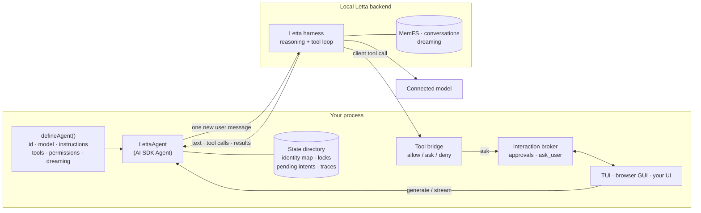

# ai-sdk-letta

A persistent, stateful [Letta](https://www.letta.com) agent, with memory and
dreaming, behind the [Vercel AI SDK](https://ai-sdk.dev) `Agent` interface.
Your application owns the tools and the human-in-the-loop.

> **Unofficial.** ai-sdk-letta is an independent project. It is not affiliated
> with, endorsed by, or sponsored by Letta or Vercel.

## What and why

The AI SDK gives you one interface for models, tools, streaming and UIs.
Letta gives you agents that *persist*: one identity with long-term memory
(MemFS, a git-versioned memory filesystem), many conversations, and
background "dreaming" that consolidates memory between turns. ai-sdk-letta
puts the two together:

- **`LettaAgent`** implements the AI SDK `Agent` interface (`generate`,
  `stream`). Letta runs the only reasoning and tool loop. Each call sends
  exactly one new user message; Letta keeps the transcript.
- **Tools are yours.** You define ordinary AI SDK `tool()`s. They run in *your*
  process when the agent calls them, through Letta's client-tool protocol,
  behind a fail-closed `allow` / `ask` / `deny` policy with schema validation,
  deadlines, cancellation and a metadata-only audit trail.
- **Human-in-the-loop is yours.** Per-call approvals and a built-in `ask_user`
  question tool go through an interaction broker that you connect to any UI.
  A terminal UI and a browser UI are included.
- **Defined in code, stable identity.** You give the agent a logical ID. The
  first run creates the Letta agent and records the generated ID; later runs
  reopen the same agent, memory and conversations, and never create a duplicate.

## Architecture



| Package | What it is | License | On npm |
| --- | --- | --- | --- |
| [`ai-sdk-letta`](packages/ai-sdk-letta) | The library: `LettaAgent`, definitions, identity, conversations and history, tool bridge, interaction broker, memory policy | Apache-2.0 | yes |
| [`@ai-sdk-letta/server`](packages/server) | Local HTTP runtime: durable threads and runs, NDJSON events, answers, cancellation; a token API and a loopback browser app | Apache-2.0 | yes |
| [`@ai-sdk-letta/provider`](packages/provider) | AI SDK `LanguageModel` for Letta agents; a port of Letta's provider | **MIT** (Letta) | yes |
| [`@ai-sdk-letta/tui`](apps/tui) | Terminal UI (patched `@ai-sdk/tui`) with `/resume`, `/search`, approvals and questions | Apache-2.0 | not yet ([why](#not-on-npm-yet)) |
| [`@ai-sdk-letta/web`](apps/web) | assistant-ui browser app served by the server package | Apache-2.0 | not yet ([why](#not-on-npm-yet)) |
| [`examples/basic`](examples/basic) | A minimal agent with one custom tool, in the terminal and the browser | Apache-2.0 | no |

### Provider or Agent?

- Use **`@ai-sdk-letta/provider`** for `generateText` / `streamText` against an
  existing Letta agent, where Letta runs its own tools. It is a plain AI SDK
  model provider.
- Use **`LettaAgent`** when your application defines the agent in code, owns
  the tools and needs approvals or questions from a human. It adds identity
  mapping, delivery safety, conversations, history restore and the policy
  layer. The two packages share no runtime code today: the provider speaks
  `LanguageModelV2` for broad AI SDK compatibility, while `LettaAgent`
  implements the `Agent` interface on `LanguageModelV4`, and the delivery and
  replay guarantees differ. Merging them would have changed tested behaviour
  in both.

## Prerequisites

- Node.js 22.19 or newer, and npm.
- The Letta CLI and a **local Letta backend** with a **connected model**. The
  library uses the Letta Agent SDK's `local` backend, which starts the Letta
  App Server itself; you do not run a server process. From the
  [Letta self-hosting guide](https://docs.letta.com/self-hosting/index.md):

  ```sh
  npm install -g @letta-ai/letta-code
  letta --backend local connect ollama        # or: anthropic, openai, lmstudio, ...
  ```

  For example, to use a ChatGPT Plus/Pro subscription, connect the `chatgpt`
  provider (`letta --backend local connect chatgpt`), or run `/connect` inside
  `letta`. See [Models](https://docs.letta.com/configuration/models/index.md)
  for every provider.
- A model **handle** for your definition. List what your backend offers with:

  ```sh
  letta --backend local model list
  ```

  The example defaults to `openai-codex/gpt-5.5`; set `LETTA_MODEL` to use
  another handle.

No Letta account or model is needed to install, typecheck, test or build this
repository.

## Install

```sh
npm install ai-sdk-letta ai                 # the LettaAgent library (ai is a peer dependency)
npm install @ai-sdk-letta/server            # optional: the local HTTP runtime
npm install @ai-sdk-letta/provider ai zod   # or: the plain AI SDK provider
```

The packages are ESM, typed, and need Node.js 22.19 or newer. `ai-sdk-letta`
and `@ai-sdk-letta/server` always share a version; `@ai-sdk-letta/provider`
is versioned on its own. Releases and changelogs:
[GitHub releases](https://github.com/leonardschneider/ai-sdk-letta/releases).

### Not on npm yet

- **`@ai-sdk-letta/tui`** needs a patched `@ai-sdk/tui`. The patch is applied
  by this repository's `postinstall`, which does not run for packages
  installed from npm, so the TUI is used from a checkout of this repository
  for now (`npm run tui`). Whether it will depend on a published fork of
  `@ai-sdk/tui` or wait for the changes upstream is still open.
- **`@ai-sdk-letta/web`**, the browser app, is built in this repository and
  passed to `startGuiServer` as an assets directory (`npm run gui`). How it
  will be packaged for npm is a follow-up.

## Quickstart (from source)

```sh
git clone https://github.com/leonardschneider/ai-sdk-letta.git
cd ai-sdk-letta
npm ci
npm run build             # builds every package and the web app

npm run tui               # terminal UI for the example agent
npm run gui               # browser UI on http://127.0.0.1:4400
```

Both run [`examples/basic`](examples/basic). The first run creates a Letta
agent named "Example Assistant"; later runs reopen it. Useful variables:
`LETTA_MODEL` (model handle), `AGENT_ID` (logical ID, for a throwaway agent),
`AI_SDK_LETTA_STATE_DIR` (state directory), `TEXT_STATS_PERMISSION=ask` (try
approvals). Pass options after `--`, for example `npm run gui -- --port 4500`
or `npm run tui -- --new "Planning"`.

## Defining an agent and tools

```ts
import { tool, jsonSchema } from 'ai';
import { askUserTool, createLettaAgent, defineAgent } from 'ai-sdk-letta';

const agent = defineAgent({
  id: 'support-assistant',                 // stable logical ID, never reused for another agent
  name: 'Support Assistant',
  model: 'anthropic/claude-sonnet-4-5',    // any handle from `letta --backend local model list`
  instructions: 'You help customers. Look up orders with lookup_order.',
  tools: {
    lookup_order: tool({
      description: 'Look up an order by ID.',
      inputSchema: jsonSchema<{ id: string }>({
        type: 'object', properties: { id: { type: 'string' } }, required: ['id'], additionalProperties: false,
      }),
      execute: async ({ id }) => ({ id, status: 'shipped' }),
    }),
    ask_user: askUserTool,                 // optional: structured questions to the human
  },
  // Fail-closed: every tool needs an entry. 'ask' prompts for approval per call.
  permissions: { lookup_order: 'ask', ask_user: 'allow' },
  dreaming: { trigger: 'step-count', stepCount: 25 },
});

const { agent: support, close } = await createLettaAgent(agent);
support.interactions.connect(async request =>
  request.kind === 'approval'
    ? { id: request.id, approved: true }               // render a real prompt here
    : { id: request.id, text: 'Please use express shipping' });
try {
  const result = await support.generate({ prompt: 'Where is order 42?' });
  console.log(result.text, result.toolResults);
} finally {
  await close();
}
```

`LettaAgent` is a regular AI SDK `Agent`, so `stream()` returns a
`StreamTextResult` (`toUIMessageStream()`, `fullStream`, ...). Tool calls
arrive as `providerExecuted` parts: the AI SDK displays them but never runs
them itself.

### Images

A user turn can carry images as AI SDK `image` or `file` parts (base64,
bytes or `data:` URLs; `convertToModelMessages` output works as is). They
are sent to Letta as `ImageContent`, together with the text, as one new user
message:

```ts
import { readFileSync } from 'node:fs';
await support.generate({ messages: [...support.transcript, { role: 'user', content: [
  { type: 'text', text: 'What is in this screenshot?' },
  { type: 'image', image: readFileSync('screenshot.png') },
] }] });
```

- **Types and limits:** PNG, JPEG, GIF and WebP, checked by content (not by
  name or declared type); up to 5 MB per image, 4 images and 10 MB in total
  per message (`IMAGE_LIMITS`). Anything else fails before delivery with an
  `ImageInputError` whose `code` is one of `image_unsupported_type`,
  `image_invalid`, `image_remote_url`, `image_too_large`, `images_too_many`,
  `images_too_large`. Image URLs are never fetched.
- **No replay:** history must still extend exactly what was sent. Images in
  history are compared by a SHA-256 of their bytes, and the agent keeps only
  that hash (`agent.transcript`), never a second copy of the image.
- **The model must accept images.** The Letta harness passes them to the
  connected model; verified with `openai-codex/gpt-5.5`.
- **Images are stored in Letta history,** and so in the local backend's agent
  state (`LETTA_LOCAL_BACKEND_DIR`) like any message. Restored conversations
  show them again: the browser app displays the newest 48 MB of images per
  conversation and `[Image]` for older or undisplayable ones; the terminal
  shows `[Image]`. The HTTP runtime's own state files record only each
  image's type, size and hash.

### Files

Add the built-in file tools to a definition to let users attach files:

```ts
import { defineAgent, fileTools, FILE_TOOL_PERMISSIONS } from 'ai-sdk-letta';

defineAgent({ ...,
  tools: { ...fileTools, lookup_order },                         // list_files, read_file, search_files
  permissions: { ...FILE_TOOL_PERMISSIONS, lookup_order: 'ask' }, // 'allow' by default; 'ask' or 'deny' work too
});
```

They are opt-in, like every tool: a definition without them (or with
`read_file: 'deny'`) accepts images only, exactly as before. The example
agent includes them.

- **How it works.** Attached files are stored in the conversation's folder
  of the agent's [resources](#resources). The user's message carries only a short note per file,
  such as `Attached: report.pdf (PDF, 12 pages, 2.1 MB)`, never the content.
  The agent then reads what it needs: `list_files(folder?)` (name, type, size, page
  or line count), `read_file(name, range)` (PDF pages such as `"3"` or
  `"2-4"`, or text lines; about 12,000 characters per call, and the result
  says when it is truncated and which range to read next) and
  `search_files(query, name?, folder?)` (passages with file name and page or line).
- **The current conversation first, every conversation reachable.** The
  runtime binds the tools to the conversation it opened: a plain name such as
  `report.pdf` or `data/raw.csv` resolves in that conversation's folder, and a
  name starting with `/` (`/Trip planning/itinerary.md`; `/workspace/...`
  works too) resolves from the resources root, so the agent can use files
  from any of its conversations. `list_files` with folder `"/"` lists them
  all. Names never leave the root: `..`, hidden names and symlinks are
  refused, and hard-linked files are not read. Files the agent creates with
  shell commands are readable too, described by content.
- **Types, detected by content:** plain text, Markdown, CSV, JSON, code and
  other UTF-8 text (binary content is refused whatever its name), PDF, and
  the image types above. Office documents are refused with a hint to export
  a PDF. Errors are `FileInputError`s with a fixed `code`:
  `file_unsupported_type`, `file_invalid`, `file_too_large`,
  `files_too_many`, `conversation_files_full`, `file_not_found`,
  `file_name_invalid`, `file_range_invalid`, `file_exists`, `resources_busy`,
  `resources_full`.
- **PDFs** are read with [unpdf](https://github.com/unjs/unpdf) (Mozilla's
  PDF.js, pure JavaScript, no native modules) in a worker thread with a
  memory cap and a deadline. Scripts in PDFs are never run. Text is
  extracted once, when the file is attached. **Scanned pages** (no text
  layer): `read_file` returns the page's own image to the model (decoded by
  PDF.js and encoded as PNG, up to 1600 px), so the model can read it. A
  page without text or a large image (a vector drawing) is reported as
  having no extractable text. Password-protected PDFs are refused.
- **Images** are still sent inline, as before, and are also saved to the
  folder, so `list_files` shows them and `read_file` can show one again.
- **Limits** (`FILE_LIMITS`): 25 MB per file, 8 files per message (images
  keep their own limits), 100 attached files and 250 MB per conversation
  folder, the first 2,000 pages of a PDF.
- **No replay.** The note is ordinary text in Letta history. In the
  transcript, files are kept as SHA-256 references, like images; history
  that changes a file is refused as an edit.
- **From code**, pass AI SDK `file` parts in the new user turn
  (`{ type: 'file', mediaType, filename, data }`, with bytes, base64 or a
  `data:` URL; remote URLs are never fetched).

### Resources

All of an agent's files live in one folder, its **resources**, versioned
with git: one folder per conversation, plus any folders the user makes.
The GUI shows them in a panel where the user can preview, upload, move,
rename and delete them (see [GUI](#gui)); the TUI lists them with `/resources`.
They are enabled by the file tools or the sandbox.

```
<state>/resources/<letta agent ID>/
  files/            the work tree: one folder per conversation (named after its title) and user folders
  git/              the git repository (separate from the work tree; no remote)
  cache/            text extracted from PDFs, by content hash
  state.json        which folder belongs to which conversation; where each attached file is now
  resources.lock    held during a git operation
```

- **Folders are named after the conversation's title** (made a valid,
  unique name; "Trip planning", "Trip planning (2)") and **follow it**: when
  the conversation is renamed, its folder is renamed too, as one commit
  (`Rename folder Trip planning → Lisbon`), wherever the folder is now, also
  if you renamed or moved it in the panel. While a turn of that conversation
  runs, the rename waits until the turn ends (after its end-of-turn commit),
  so commands that are running keep their working directory. A folder you
  deleted is not recreated by a rename. The mapping from conversation to
  folder is stored by ID, so it survives renames and moves of the folder
  (also `mv` in the sandbox, followed by inode).
- **One commit per change.** Every user operation (upload, new folder, move,
  rename, delete, restore) is one commit with a clear message, such as
  `Rename Trip planning/notes.txt to itinerary.md`. Attachments are committed
  as `Attach report.pdf in Trip planning`. Whatever the agent changed during
  a turn, finished or not, is committed at the end of the turn as
  `Agent changes in <folder>`. A user operation commits only its own paths,
  so a user action during a turn never sweeps up the agent's half-done work.
  Changes made while the app was closed are committed on the next start.
- **Git runs isolated and serialized.** A fixed identity
  (`ai-sdk-letta <resources@ai-sdk-letta.invalid>`), `GIT_CONFIG_GLOBAL=/dev/null`,
  `GIT_CONFIG_NOSYSTEM=1`, literal pathspecs, no hooks, no remote. A lock
  (a queue in the process plus a lock file across processes; a lock left
  by a process that died is taken over) keeps user actions, the agent's
  commit and other processes from racing.
- **The agent cannot rewrite the history.** The repository lives in `git/`,
  next to the work tree, and only `files/` is mounted in the sandbox. From
  `/workspace`, `git` finds no repository, so the agent's own `git` commands
  never touch the resources history. Repositories the agent creates in a
  folder (`git init` in `/workspace/<folder>/project`) work as before; their
  files are versioned by the resources too (their `.git` is not), and their
  settings are reduced to plain ones and active hooks removed, because git
  on your computer would obey them.
- **Not versioned:** `.venv/`, `.home/`, `__pycache__/`, `node_modules/` and
  other caches (the list, `RESOURCES_GITIGNORE`, is kept in the repository's
  `info/exclude`, which commands cannot change; `.gitignore` files in
  folders apply too), symlinks, and files over 100 MB. Hidden entries (names
  starting with a dot), `__pycache__` and `node_modules` are not shown.
- **Deleting keeps history.** The panel's Undo restores a deleted file or
  folder from the commit before the delete. To recover anything later, use
  git directly:

  ```sh
  cd <state>/resources/<letta agent ID>
  git --git-dir=git --work-tree=files log --stat               # what changed, when
  git --git-dir=git --work-tree=files restore --source=<commit>^ -- "Trip planning/notes.txt"
  ```

- **Upgrading from 0.3.** Files attached with 0.3 (in
  `<state>/attachments/<agent ID>/<conversation ID>/`) are moved into the
  resources automatically the first time the agent opens: each conversation
  gets a folder named after its title, the files keep their names, the move
  is one commit (`Import attachments from earlier versions`), and the old
  folders are kept aside in `<state>/attachments/<agent ID>/.migrated/`. It
  is idempotent and resumable. Links to files in older messages keep working,
  also after you move or rename the files: they resolve through the record
  of where each attached file is now (`state.json`), then the conversation's
  folder, then the same content anywhere in the resources.
- **From code:** `ResourceStore.open(statePaths(dir).resources, agentId)`
  gives `tree()`, `upload()`, `createFolder()`, `move()`, `delete()`,
  `restore()`, `log()` and `commitAll()`; `LettaRuntime.resources` is the
  open agent's store.

### Shell commands (sandbox)

Add the built-in sandbox tools and a `sandbox` option to let the agent run
shell commands, for example to compute with Python, search with `rg` or use
git, in an isolated Linux sandbox:

```ts
import { defineAgent, fileTools, FILE_TOOL_PERMISSIONS, sandboxTools, SANDBOX_TOOL_PERMISSIONS } from 'ai-sdk-letta';

defineAgent({ ...,
  tools: { ...fileTools, ...sandboxTools },                          // run_command, run_command_online
  permissions: { ...FILE_TOOL_PERMISSIONS, ...SANDBOX_TOOL_PERMISSIONS }, // run_command: 'allow', run_command_online: 'ask'
  sandbox: { provider: 'apple-container' },                          // or 'docker', or your own factory
});
```

```sh
# macOS 26 on Apple silicon (brew install container && container system start):
npm install --save-exact @lgrammel/apple-container-sandbox@1.1.0 @ai-sdk/harness@1.0.128
# or Docker:
npm install --save-exact ai-sdk-sandbox-docker@0.1.2 @ai-sdk/harness@1.0.128
```

- **Two tools.** `run_command(command, cwd?)` runs a bash command with **no
  network** and returns the exit code and output. `run_command_online` is the
  same with internet access (for `pip install` or a download); it **always
  asks** the user, who sees the exact command, and its permission cannot be
  `'allow'`. Commands run through the AI SDK's standard
  `Experimental_SandboxSession` (`run()`), which the runtime also passes to
  every tool as `experimental_sandbox`.
- **Why two tools rather than a `network` flag.** Docker and Apple Container
  fix a container's network when it starts. A network command therefore runs
  in its own short-lived sandbox that mounts the same workspace and is
  removed right after; everything else runs in the conversation's sandbox,
  which never has a network interface. A separate tool also makes the
  approval policy per tool (allow vs. ask) instead of per argument.
- **Workspace.** `/workspace` is the agent's [resources](#resources) work
  tree, read-write: every conversation's folder, so commands can use files
  from other conversations. Commands start in the current conversation's
  folder (`cwd` is relative to it; absolute paths under `/workspace` work).
  Files the agent creates appear in the Resources panel and are committed at
  the end of the turn, owned by your user. The resources' git history is
  not mounted. An optional project folder is mounted at `/project`
  (`sandbox.project`, or `{ path, readOnly: true }`).
- **Python packages persist.** Commands use one virtual environment,
  `/workspace/.venv`, shared by all conversations (created on first start,
  hidden and not versioned); `pip install` puts packages there, so a later
  turn, conversation or run still has them.
- **One sandbox per conversation**, started on the first command, reused
  across turns, stopped after 10 minutes without commands (`idleTimeoutMs`)
  and when the agent closes. Commands of a conversation run one at a time.
  Containers are labelled `ai-sdk-letta.sandbox`; containers left by a
  process that died (`kill -9`, a crash) are removed the next time a sandbox
  starts on that machine.
- **Timeouts and Stop.** Each command has a timeout (`timeoutMs`, default 2
  minutes, at most 4). On timeout, or when the user stops the turn, the
  command and everything it started are killed inside the sandbox (the
  container CLIs only kill their local client).
- **Output** is capped at about 14,000 characters: the start and end of
  stdout and stderr are kept, with a notice saying how much was omitted.
- **Isolation.** Only the workspace (and the project, if set) is mounted: no
  home folder, `~/.ssh`, git config or Docker socket. Commands start from an
  empty environment plus a fixed set (`PATH`, `HOME=/workspace/.home`, ...);
  nothing from your process leaks in. The container runs as your UID with
  no capabilities, `no-new-privileges` (Docker), a read-only root file system
  and a private `/tmp`, 2 CPUs and 2 GB of memory by default.
- **Git** works on mounted repositories with `GIT_CONFIG_GLOBAL=/dev/null`
  and `GIT_CONFIG_NOSYSTEM=1`; commits use the identity in `sandbox.git`
  (default `Sandbox <sandbox@localhost>`). There is no push tool and no
  credentials, by design: **pushing stays with you**.
- **Project folders with credentials are refused.** Before mounting, the
  project's `.git/config` is checked: a remote URL with user info
  (`https://token@...`), any `credential` setting, `http.extraHeader` or an
  `include` refuse the mount with a `SandboxError` (`project_has_credentials`).
  Home folders, the file system root and folders containing `.ssh`, `.aws`,
  `.netrc` and similar are refused too (`project_unsafe`). Because git on
  your computer obeys the repository's settings, `.git/hooks` is mounted
  read-only and changes to `.git/config` made by a command are reverted.
- **Image.** The built-in providers use `python:3.12-slim-bookworm` pinned by
  digest plus Python 3, pip, git, ripgrep, jq, poppler-utils and curl
  (`SANDBOX_DOCKERFILE`). It is built once per machine and cached as
  `SANDBOX_IMAGE`; the first build takes about 30 seconds to 2 minutes
  depending on the network. `prepareSandbox(config)` does it ahead of time.
  Starting a sandbox takes about 1 second (Apple Container) or less (Docker).
- **Providers** are optional peer dependencies, pinned exactly because the AI
  SDK sandbox APIs are experimental:
  [`@lgrammel/apple-container-sandbox`](https://www.npmjs.com/package/@lgrammel/apple-container-sandbox)
  1.1.0 (MIT; Apple Container micro-VMs) and
  [`ai-sdk-sandbox-docker`](https://www.npmjs.com/package/ai-sdk-sandbox-docker)
  0.1.2 (Apache-2.0, community). Install only the one you use, with
  `@ai-sdk/harness` 1.0.128 (the release built on `ai` 7.0.118; without the
  pin, the Apple package's `^1.0.10` range pulls a newer harness and a second
  copy of `ai`). A custom
  `provider` is a function that receives `{ network, mounts, labels, image }`
  and returns `{ session, stop }` with any `Experimental_SandboxSession`; it
  must honour `network: false`.
- **Without a sandbox** (no `sandbox` option, or no provider available) the
  tools are never exposed to the model, whatever the permissions say. The
  example picks Apple Container if it runs, else Docker, else disables the
  tools with a startup message (`SANDBOX_PROVIDER=apple-container|docker|off`).

What a definition controls, and when:

| Field | Applied |
| --- | --- |
| `id`, `name` | Every start: the mapping and the Letta agent name must match, or startup fails. |
| `model`, `instructions` | At creation only. To change them, create a new logical ID (or change the agent in Letta). |
| `tools`, `permissions`, `toolTimeoutMs`, `sandbox` | Every start. |
| `dreaming` | Every start, scoped to this project (see below), then verified. |

## TUI

```sh
npm run tui                        # startup picker: resume, pick, or create a conversation
npm run tui -- --resume            # reopen the last conversation
npm run tui -- --new "Planning"    # new conversation
npm run tui -- --conversation ID   # a specific conversation
npm run tui -- --list              # list conversations and exit (no TTY needed)
```

Inside: `/resume [title or ID]`, `/search [text]` (this agent's
conversations only), `/resources`, `/help`; PgUp/PgDn scroll restored history; Esc exits.
Approvals and questions appear as prompts during the turn that needs them.
Shell commands show as "Ran `command`" cards with the exit code, the command
and the first lines of output (verbatim).

**Resources.** `/resources` lists the agent's [resources](#resources), one
folder per conversation, with sizes, and marks the current conversation's folder.

**Images.** Press **Ctrl+V** to attach an image from the clipboard, or drag
an image file into the terminal (or paste its path; shell-escaped, quoted
and `file://` paths all work). Each attachment shows as `[Image 1]`,
`[Image 2]`, ... in the prompt; Backspace right after a marker removes it.
Sent and restored messages show `[Image]`. With the file tools, dropping or
pasting the path of a PDF, text, Markdown, CSV, JSON or code file attaches
it as `[File 1: report.pdf]`; Backspace right after the marker removes it,
and sent and restored messages show `[File: report.pdf]`. Clipboard access uses `osascript`
on macOS (screenshots, copied images, or image files copied in Finder) and
`wl-paste` or `xclip` on Linux when installed; without them, Ctrl+V shows a
short notice and dropping a file still works. The terminal does not resize
images: files over 5 MB are refused with a notice (the browser app
downscales automatically).

Use it from code with `runTerminal(definition, process.argv.slice(2))` from
`@ai-sdk-letta/tui`.

**The `@ai-sdk/tui` patch.** The TUI depends on `@ai-sdk/tui` pinned at
1.0.119 plus [a patch](apps/tui/patches) applied by `patch-package` on
install. It adds display-only restored history, local slash commands, and an
interaction renderer for approvals and questions. These changes are being
upstreamed through a fork of `vercel/ai`; until then, keep the pinned version.
Because the patch only applies inside this repository, `@ai-sdk-letta/tui` is
not published to npm yet.

## GUI

```sh
npm run gui                        # http://127.0.0.1:4400
npm run gui -- --port 4500 --state-dir /path/to/state
```

A browser app built with [assistant-ui](https://www.assistant-ui.com):
threads with rename and archive, streaming replies, tool activity lines with
collapsed technical details, docked approval and question cards, and safe
Markdown.

**Images.** Paste an image (⌘V / Ctrl+V), drop image files on the composer,
or use the paperclip. Thumbnails can be removed before sending; images
larger than 2048 px are downscaled in the browser (and re-encoded if still
over 5 MB). Sent images appear in your message, also after a reload, and
open larger on click. Pasting text still pastes text, including rich text
copied with a snapshot image (as Office apps do). Unsupported, oversized or
too many images show a notice and are not attached.

**Commands.** Shell commands read as one line each, "Ran `rg budget`",
collapsed by default, with "exit 1" or "timed out" when a command failed.
Expanding shows the exact command, the exit code and the output in
monospace, with "show more" for long output. Approval cards for
`run_command_online` show the exact command.

**Panels.** The conversations sidebar collapses with the button next to the
agent's name or **⌘B** (Ctrl+B); the **Resources** panel opens with the
folder button at the top right or **⌘⇧E** (Ctrl+Shift+E), and can be resized
by dragging its edge. Both are remembered. On a phone, both are drawers.

**Resources.** The panel shows the agent's [resources](#resources): one
folder per conversation (the current one is marked "this chat" and opened)
and your own folders, with file icons by type and sizes. Drag a file or
folder onto a folder to move it; drop files from your computer onto a folder
to upload them; right-click or use ⋯ for Preview, Download, Rename (inline;
also F2), Move to…, New folder, Upload and Delete (with a confirmation, and
an Undo in the notice). Files the agent creates appear while it works.
Click a file to **preview** it: CSV and TSV as a table (the first 500 rows),
Markdown with the same safe renderer as the chat, text, images, PDFs in the
browser's viewer, and HTML in a sandboxed frame without scripts. Previews
are served under a policy that allows no script, no network and no access to
the app (`default-src 'none'; sandbox`); HTML is shown only inside it.

**Files.** With the file tools, the same paperclip, drop and paste attach
PDFs and text files (Markdown, CSV, JSON, code). Each is uploaded and
checked by the server right away and appears as a chip with its name, type
and size, removable before sending; refused files show a notice. In your
message, file chips download the file on click, also after a reload. The
agent's file activity reads as one line each ("Read report.pdf, pages 1–3",
"Searched files for “budget”"), collapsed like other tools. Use it from code with `startGuiServer(definition, assetsDir, options)`
from `@ai-sdk-letta/server`. The same package offers `startApiServer` for a
token-authenticated server-to-server API with the same routes.

## Security model

- **Tools fail closed.** A tool without a permission entry, or with `deny`, is
  never exposed. Arguments are validated against the tool's JSON Schema before
  any prompt or execution. Each call ID runs at most once. Approval is bound to
  a snapshot of the exact arguments. Handlers get a deadline and an abort
  signal; outputs are size-bounded and errors are reduced to fixed codes.
- **Human answers are exactly-once.** Each prompt has a unique ID; answers are
  validated against it and accepted once. Stale, duplicate or malformed
  answers are rejected. Without a connected renderer, prompts fail closed.
- **No replay.** `LettaAgent` sends only the newest user message, and rejects
  history that does not extend exactly what it already sent. After a failure
  or cancellation it refuses further turns.
- **Uncertain delivery blocks.** A durable intent is written before each turn
  and removed only after a confirmed finish. If the process dies in between,
  that conversation stays blocked until you inspect it; nothing is resent.
  Agent and conversation creation use the same pattern, so a crash cannot
  create duplicates.
- **Memory is confined.** The harness gets only `Read`, `Write` and `Edit` on
  Markdown files inside the agent's own MemFS directory (no dot-files,
  traversal, symlinks or hard links) and one exact `git commit` command.
- **The GUI is loopback-only.** It binds to 127.0.0.1 and checks the Host
  header, the Origin, and fetch metadata. A random HttpOnly, SameSite=Strict
  cookie authenticates the browser, and every mutation also needs an
  in-memory CSRF token. No bearer token reaches the browser. A strict CSP
  applies (images: same origin, `data:` and `blob:` only, never remote),
  Markdown skips raw HTML and never loads remote images, and technical
  details stay collapsed by default. Only `POST /v1/runs` accepts a larger
  body (about 13.4 MB, for images) and only `POST /v1/uploads` accepts raw
  file bytes (`application/octet-stream`, up to 25 MB, CSRF-protected like
  every mutation); every other route keeps a 24 KB limit. Images and files
  are validated again on the server (type by content, size, count). File
  downloads are same-origin, need the session, and are always sent as
  attachments (`Content-Disposition: attachment`, text as `text/plain`,
  `nosniff`, a sandboxing CSP), so a file never runs as part of the app.
  Previews are inline but in a frame of their own under
  `default-src 'none'; ...; sandbox` (an opaque origin: no script, no
  network, no cookies; PDFs get the browser's viewer under a policy without
  scripts or network); the app's own CSP allows frames from itself only.
  The resources routes (`/v1/resources...`) need the session, every change
  needs Origin and CSRF, and paths are checked on the server (no `..`, hidden
  names or symlinks).
- **Files are confined** to the agent's [resources](#resources); the file
  tools only read, and the sandbox mounts the work tree but never its git
  history.
- **Shell commands run in a sandbox** without network, credentials or host
  environment; network commands always ask (see
  [Shell commands](#shell-commands-sandbox)).
- **The token API** needs a 256-bit bearer token (stored 0600) plus an owner
  header, and rejects browser origins.
- **Audit.** Tool activity is logged as metadata only (tool, status, duration,
  hashed call ID) in private files under the state directory.

## State and identity

State lives in one directory, resolved in this order:

1. the `stateDirectory` option (`--state-dir` in the example CLIs);
2. the `AI_SDK_LETTA_STATE_DIR` environment variable;
3. `$XDG_STATE_HOME/ai-sdk-letta`, else `~/.local/state/ai-sdk-letta`
   (Linux and macOS), or `%LOCALAPPDATA%\ai-sdk-letta\state` (Windows).

```
<state>/
  agents/                  identity mappings, locks, pending intents; the Letta session cwd
    <id>.json              logical ID -> Letta agent ID, backend, last conversation
    <id>.lock              held while a process has the agent open
    <id>.pending.json      an agent creation whose outcome is unknown
    <id>.<conv>.turn.pending.json   a turn whose delivery is unconfirmed
  tool-traces/             metadata-only tool audit (NDJSON, per day)
  server/<id>/gui|api/     thread and run records for the HTTP runtime
    uploads/.staging/      browser uploads not yet sent (removed after 24 hours)
  resources/<letta agent ID>/
                           all files, git-versioned: files/ (one folder per conversation), git/, cache/, state.json
  attachments/<letta agent ID>/.migrated/
                           files of 0.3 kept aside after they were moved into resources/
```

**Files** stay in the agent's resources, including after a conversation is
archived; they are never sent anywhere except to the model through the file
tools and the sandbox. Manage them in the GUI's Resources panel, or with git
(see [Resources](#resources)).

**Keeping an existing agent.** The mapping is what ties a logical ID to a
Letta agent. To reuse an agent you already created with an earlier tool or
version, point `AI_SDK_LETTA_STATE_DIR` (or `stateDirectory`) at a directory
whose `agents/<id>.json` holds that mapping, and use the same `id` and
`name`. Nothing is migrated or modified automatically; if the mapping names a
different backend or agent name, startup fails rather than creating a new
agent.

The mapping is also keyed to the Letta local backend directory
(`LETTA_LOCAL_BACKEND_DIR`, default `~/.letta/lc-local-backend`).

**Recovering after a crash.** Errors name the exact file. A `.lock` whose PID
is no longer running can be removed. A `pending` intent means an outcome is
unknown: inspect the backend (for example with the Letta CLI) and reconcile
by hand before removing it.

**Dreaming is project-scoped.** The Letta Agent SDK's `dreaming` option also
writes the user's global Letta settings. ai-sdk-letta does not use it.
Instead it sends the App Server's `set_reflection_settings` command with scope
`local_project`, whose project is the private `agents/` directory, and
verifies the effective settings on every start.

**Foreground tools.** By default the Letta harness moves a client tool to the
background after about 10 seconds, which would detach approvals and
questions. `openLettaAgent` sets `auto_background: false` with a five-minute
timeout for this agent's runtime (`foregroundExternalTools`, on by default).

## Limitations

- **Local backend only.** `openLettaAgent` uses the Agent SDK `local` backend.
  Letta Cloud and remote App Servers are not supported by `LettaAgent` yet
  (the provider package does support them).
- **One process per agent.** The identity lock allows one open runtime per
  logical ID. The HTTP runtime runs one turn at a time.
- **Text, images and files.** Up to 8,000 characters, 4 images (PNG, JPEG,
  GIF, WebP; 5 MB each, 10 MB total) and, with the file tools, 8 files
  (PDF or text, 25 MB each) per turn. No Office documents, no OCR (scanned
  PDF pages are shown to the model as images, so reading them depends on
  the model). No history edits, regeneration or retries by design.
- **Resources.** The panel refreshes by polling every few seconds while it
  is open (and at once when a turn ends). It lists up to 5,000 entries and
  versions up to 20,000 files; previews show files up to 25 MB, CSV and TSV
  up to 500 rows. Undo is offered right after a delete; older versions are
  recovered with git (see [Resources](#resources)), not from the app. The
  sandbox mounts all of an agent's resources, so every conversation's
  commands can change every folder (each change is committed and can be
  restored).
- **Images in restored history** are shown when Letta returns them: the
  browser displays the newest 48 MB per conversation and `[Image]` for the
  rest; the terminal always shows `[Image]`. A reply that is still running
  after a browser refresh shows `[Image]` until it completes.
- **Model and instructions are fixed at creation.**
- **Human waits are bounded** by the harness's five-minute external-tool
  limit; the HTTP runtime closes prompts earlier (four minutes by default).
- **The sandbox is experimental.** It relies on the AI SDK's
  `Experimental_SandboxSession` and on two young provider packages, all
  marked experimental and pinned exactly (`@lgrammel/apple-container-sandbox`
  1.1.0, `ai-sdk-sandbox-docker` 0.1.2, with `@ai-sdk/harness` 1.0.128, the
  release that matches `ai` 7.0.118). Network access is all or nothing for an
  approved command (no domain allowlist). Apple Container needs macOS 26 on
  Apple silicon. On Linux with rootful Docker, files are owned by your UID
  as on macOS; with user-namespace remapping they may not be. Each network
  command starts a fresh sandbox (about 1 to 2 seconds).
- **Pinned versions.** `@letta-ai/letta-agent-sdk` is pinned at 0.8.22,
  `unpdf` at 1.8.1 and `@ai-sdk/tui` at 1.0.119 (patched); `ai` is a peer dependency (`^7.0.118`;
  this repository tests 7.0.118). Some workarounds depend on SDK behaviour at
  these versions (for example, history for the default conversation is read
  through a protocol command).
- **The TUI and the browser app are not on npm yet.** Run them from a
  checkout (see [Install](#install)).
- **Live tests are opt-in** (`AI_SDK_LETTA_LIVE=1 npm run test:live`) and
  consume model usage.

## Development

```sh
npm ci
npm run typecheck
npm test                 # offline; PTY tests need python3 and skip without it
npm run build
AI_SDK_LETTA_LIVE=1 AI_SDK_LETTA_LIVE_STATE_DIR=/tmp/ai-sdk-letta-live npm run test:live
AI_SDK_LETTA_SANDBOX_TEST=docker,apple-container npm run test:sandbox --workspace ai-sdk-letta
```

The sandbox tests start real containers (and install a small package from
PyPI); they are opt-in, and the offline tests use `@ai-sdk/sandbox-just-bash`
and fakes instead.

See [CONTRIBUTING.md](CONTRIBUTING.md). Releases use Changesets and npm
trusted publishing; see [RELEASING.md](RELEASING.md).

## AI assistance

This project was developed with AI assistance, directed and reviewed by the
author.

## License

[Apache-2.0](LICENSE), except [`packages/provider`](packages/provider), which
is MIT-licensed work by Letta ([its LICENSE](packages/provider/LICENSE)). See
[NOTICE](NOTICE). "Letta" and "Vercel" are trademarks of their respective
owners.
